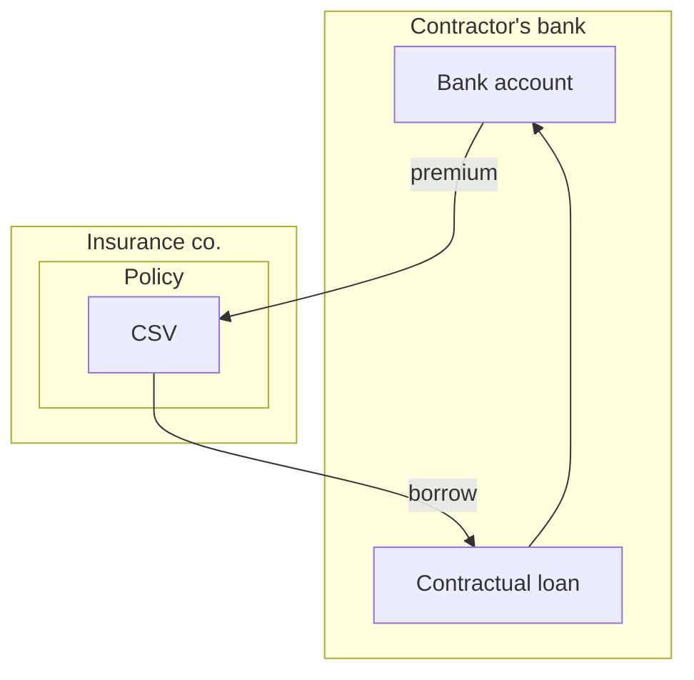
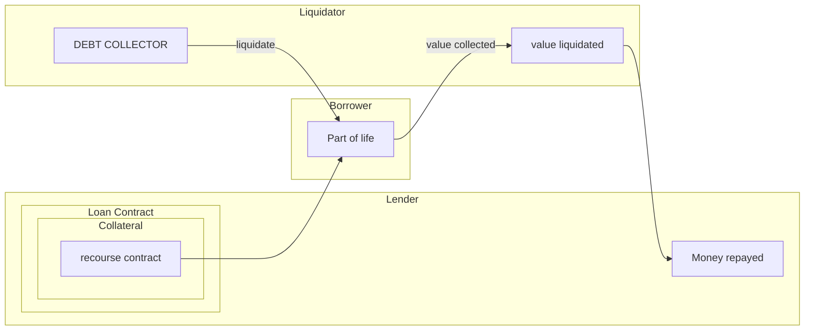
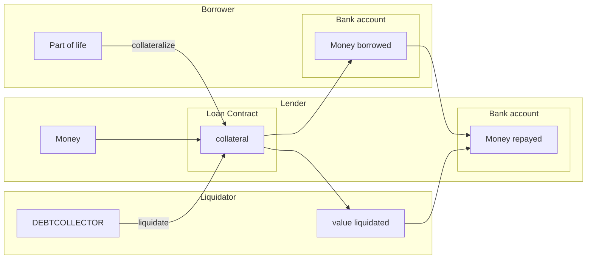
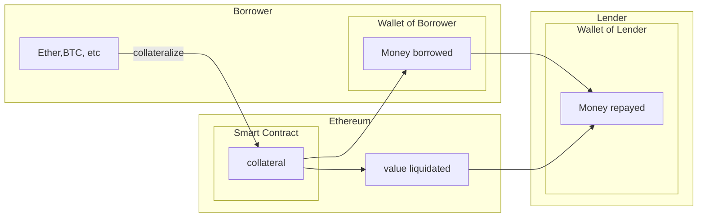

    

## Liquidation

```mermaid
graph TD;
  A[Bank account]
  B[CSV]

  A -- premium --> B -- borrow --> L --> A

  subgraph Contractor's bank
    A
    L[Contractual loan]
  end
  subgraph Insurance co.
    L
    subgraph Policy
      B
    end
  end
```

## Liquidation

```mermaid
graph LR;
  PA[Part of life];

  CA[recourse contract]

  DA[DEBT COLLECTOR]
  DB[value liquidated]

  MC[Money repayed]

  CA --> PA

  DA -- liquidate --> PA
  PA -- value collected --> DB
  DB --> MC

  subgraph Borrower;
    PA
  end
  subgraph Lender;
    MC
    subgraph Loan Contract;
      subgraph Collateral;
        CA
      end
    end
  end
  subgraph Liquidator;
    DA
    DB
  end
```

## Unsecured Loan in TradFi

```mermaid
graph LR;
  PA[Part of life];

  CA[collateral]

  DA[DEBTCOLLECTOR]
  DB[value liquidated]

  MA[Money]
  MA[Money]
  MB[Money borrowed]
  MC[Money repayed]

  PA -- collateralize --> CA
  MA --> CA
  CA --> MB
  MB --> MC

  DA -- liquidate --> CA
  CA --> DB
  DB --> MC

  subgraph Borrower;
    PA
    subgraph Bank account;
      MB
    end
  end
  subgraph Lender;
    MA
    subgraph Loan Contract;
      CA
    end
    subgraph Bank account;
      MC
    end
  end
  subgraph Liquidator;
    DA
    DB
  end
```

# Collateralized loan in DeFi

```mermaid
graph LR;
  PA[Ether,BTC, etc];

  CA[collateral]

  DB[value liquidated]

  MB[Money borrowed]
  MC[Money repayed]

  PA -- collateralize --> CA
  CA --> MB
  MB --> MC

  CA --> DB
  DB --> MC

  subgraph Borrower;
    PA
    subgraph Wallet of Borrower;
      MB
    end
  end
  subgraph Lender;
    subgraph Wallet of Lender;
      MC
    end
  end
  subgraph Ethereum;
    DB
    subgraph Smart Contract;
      CA
    end
  end
```

