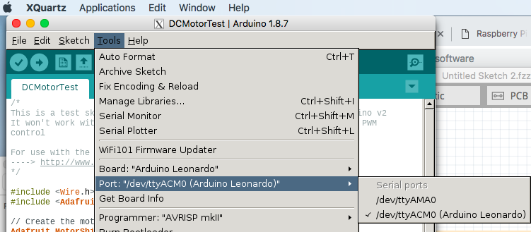
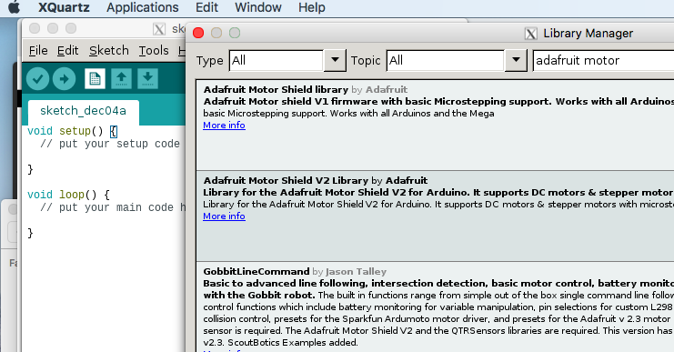

## ③ Arduino IDEの導入
apt-getで入るVerは古いので、本家からARM用のバイナリを、Download & Uploadする。
<https://www.arduino.cc/download_handler.php?f=/arduino-1.8.7-r1-linuxarm.tar.xz>
- 展開して起動する。Raspberry Piのターミナルで実行
```
tar xf ./arduino-1.8.7-r1-linuxarm.tar.xz
cd arduino-1.8.7/
./arduino
```
- うまくいった！(XQuartsが起動し、その中で Arduino IDEの窓が立ち上がる)
    - 
- 速度は（信じられないくらい）遅いが、外部Libraryも導入可能
    - 
- 勿論問題なくArduinoへSketchを投入可能。DCモーターを動かして見た

## 感想
正直XWindow周りは仕組みを理解せずにやっているのでゴリ押し感が否めない。。。がひとまずはやりたいことができた。これでRaspberry Piに突っ込むコードはscpでUPしつつArduino側はIDEで突っ込めるはずである。WIFI経由で。


　 