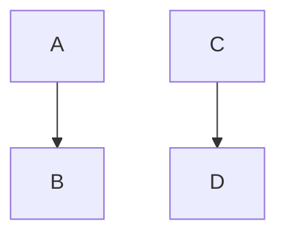

This is markdown cheat sheet.

# 見出し
# H1
## H2
### H3
#### H4
##### H5
###### H6

## 記事一覧
<ul>
  
    <li>
      <a href="{{ post.url }}">{{ post.title }}</a>
    </li>
  
</ul>

## code highlight
```
{
  "firstName": "John",
  "lastName": "Smith",
  "age": 25
}
```

## images


##diagram

## mermaid





## Reference

- <https://mmistakes.github.io/minimal-mistakes/docs/layouts/>
- <https://www.markdownguide.org/tools/github-pages/>
- <https://mmistakes.github.io/minimal-mistakes/docs/layouts/#headers>
- <https://github.com/topics/jekyll-theme>

