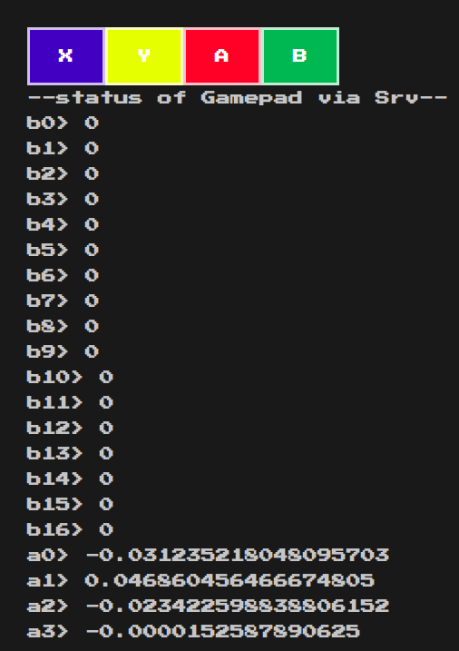

[前回の記事]()の続きです。

前回、javascriptでゲームパッドの入力取得に成功した。
こいつをリアルタイムでRaspberry Piへ突っ込んだのち、シリアル通信でArduinoへ
叩き込めばDC Motorの制御をゲームパッドからやることができる目論見である。

今回はRaspberry Piへ突っ込むところまで攻略する。
 （本記事はChromeでしか稼動確認をしていないのでご注意ください）

## Javascriptで取得したGamepadの値を、どうやってサーバ（＝Raspberry　Pi）へ突っ込むか
今回の最終ゴールはなるべくスムーズにDCモータへ値を反映することである。
- といってもどうせRPI+Arduino内でリアルタイムにデータを処理するノウハウなど持っていないので、おそらく適当にiframeを使えば十分なんだろう
- ただ、今更iframeやらXMLHttpRequestなどと10年前の技術でやるのもつまらないので、WebSocketを使って見ることにした。
    - ただ、WebSocketは使いやすそうなんだが本番向けにはプロキシ通らなそうとか、ロードバランスとか、フェールオーバとか、フェールオーバ後の再接続がすごいことになりそうとか容易に予測がつく
    - のでどこかでHTTP/2の上に乗っかるgRPCも試してみたいとは思う
- というような知識はこちらで勉強させていただいた。ありがとうございます
    - [リアルタイムなwebアプリを実現する方法(ポーリング、Comet、Server Sent Events、WebSocket)](https://qiita.com/kimullaa/items/d49bd603be17b36f7495)

## WebSocketをどうつかうか
- nodejs + socket.ioがもっとも簡単そうであったので、こちらをつかう
```shell
mkdir noderoot
cd noderoot
git clone https://github.com/creationix/nvm.git ~/.nvm
source ~/.nvm/nvm.sh
nvm install 8.9.4
npm install socket.io
npm install express
```
- コード自体は、[前回](/2018/12/08/201812-gamepad/)つくったものと、Socket.IOのサンプルをニコイチすると出来上がる
    - Socket.IOの出来がいいので、gamepadの値をStringにしてnodejsへ送信するところと、nodejsから戻ってきたデータをObjectに復号するところくらいである。作るのは
    - なお、まだやっぱりJSONのデータ作成のベストプラクティスはよくわからず。。。いつまでもゴリゴリ配列作ってていいんだろうか。。。多分違う気がするがまあいい
    - こちらを参考にさせていただきました。ありがとうございます
        - [RaspberryPi+Node.js+socket.ioでブラウザからgpioをリアルタイムに制御する](https://qiita.com/yamamotsu/items/a35a30a28523a3f51042)
        - [Write a chat application](https://socket.io/get-started/chat)
- Nodejsで動かすコードと、クライアントで動かすhtmlの２ファイルをつくる
  - DCconsoleSrv.js
```javascript
var app  = require('express')();
var http = require('http').Server(app);
var io   = require('socket.io')(http);

app.get('/', function(req, res){
  if(req.url == '/favicon.ico'){
    return;
  }
  res.sendFile(__dirname + '/DCconsole.html');
});

io.on('connection', function(socket){
  console.log('[user connected]');
  socket.on('disconnect', function(){
    console.log('[user disconnected]');
  });
  socket.on('gpFromClient', function(msg){
    //console.log('gpFromClient: ' + msg);
    io.emit('gpFromSrv', msg);
  });
});

http.listen(3000, function(){
  console.log('listening on *:3000');
});
```
  - DCconsole.html
```
<!DOCTYPE html>
<html>
<head>
    <meta charset="utf-8">
    <script src="/socket.io/socket.io.js"></script>
    <script type="text/javascript" src="http://ajax.googleapis.com/ajax/libs/jquery/2.1.0/jquery.min.js"></script>
      <style>
@import url('https://fonts.googleapis.com/css?family=Press+Start+2P');
body{
  color: rgba(255,255,255,.75);
  font-family: 'Press Start 2P', cursive;
  background-color: rgb(25,25,25);
  font-size: 1.0em;
  padding: 2.0em;
  line-height: 1.8rem;
}
.buttons{
}
.button{
  background-color: #4CAF50;
  border:rgba(255,255,255,.75) solid;
  color: white;
  padding: 15px 32px;
  text-align: center;
  text-decoration: none;
  display: inline-block;
  font-size: 16px;
}
.bb {
  background-color: rgb(39, 28, 192); 
}
.by {
  background-color: rgb(241, 255, 44); 
  border-top:rgba(255,255,255,.75) solid;
}
.br {
  background-color: rgb(247, 68, 68); 
}
.bg {
  background-color:  #4CAF50;
}
.parent {
  display: flex;
  justify-content:left;
}
.child1{
    width: 1000px;
}
.child2 {
    border: rgb(248, 45, 45) solid;
    border: #4CAF50 solid;
    padding:10px;
    font-size: 90%;
}

form input {
    color: rgba(255,255,255,.75);
    font-family: 'Press Start 2P', cursive;
    background-color: rgb(25,25,25);
    font-size: 1.0em;
    padding: 2.0em;
    line-height: 1.8rem;
    border: 0; padding: 10px; 
    border-top:rgba(255,255,255,.75) solid;
    border-left:rgba(255,255,255,.75) solid;
    border-bottom:rgba(255,255,255,.75) solid;

}
form button {
    color: rgba(255,255,255,.75);
    font-family: 'Press Start 2P', cursive;
    background-color: rgb(224, 34, 81);
    font-size: 1.0em;
    padding: 2.0em;
    line-height: 1.8rem;
    border: 0; padding: 10px; 
    border-top:rgba(255,255,255,.75) solid;
    border-right:rgba(255,255,255,.75) solid;
    border-bottom:rgba(255,255,255,.75) solid;
}


    </style>
</head>
<body>
<script>
    function setMessage(selector,text) {
        $(selector).html(text);
    }
    function addMessage(selector,text) {
        $(selector).html($(selector).html()+"<br/>"+text);
    }
    function invertColors(elem) {
        var color = $(elem).css('color');
        $(elem).css('color') = $(elem).css('background-color');
        $(elem).css('background-color') = color;
    }
    function pickGPtoJSON(gp){
        var bi;
        var json = [];
        for( bi=0; bi < gp.buttons.length; bi++ ){
            json.push({ "btnNo" : "b" + bi, "value" : gp.buttons[bi].value});
        }
        for( bi=0; bi < gp.axes.length; bi++ ){
            json.push({ "btnNo" : "a" + bi, "value" : gp.axes[bi]});
        }
        return json;
    }

    function mainLoop(){
        var bi;
        var gp = navigator.getGamepads()[0];
        if (gp) {
            /*
            setMessage("#status","---status-------")
            for( bi=0; bi < gp.buttons.length; bi++ ){
                addMessage("#status", "b:"+bi + "> " + gp.buttons[bi].value + ":" + gp.buttons[bi].pressed)
            }
            for( bi=0; bi < gp.axes.length; bi++ ){
                addMessage("#status", "a:"+bi + "> " + gp.axes[bi])
            }
            */
            socket.emit('gpFromClient', JSON.stringify(pickGPtoJSON(gp)));
        }
        lp = raf(mainLoop);
    }
    var abcString;
    var gp = false;
    var lp;
    var raf  = window.requestAnimationFrame || window.mozRequestAnimationFrame || window.webkitRequestAnimationFrame || window.msRequestAnimationFrame;
    var rafS = window.mozCancelRequestAnimationFrame || window.webkitCancelRequestAnimationFrame || window.cancelRequestAnimationFrame;
    var socket;
    var parsedMsg;
    $(document).ready(function() {

        window.addEventListener("gamepadconnected", function(e) {
            gp = navigator.getGamepads()[e.gamepad.index];
            addMessage("#console","[NAME:"+ gp.id +"], [# OF BUTTONS:"+gp.buttons.length+"], [# OF AXES:"+gp.axes.length+"]");
            mainLoop();
        });
        window.addEventListener("gamepaddisconnected", function(e) {
            gp = false;
            addMessage("#console","connection terminated");
            rafs(lp);
        });
        
        socket = io();
        socket.on('gpFromSrv', function(msg){
            var bi;
            parsedMsg = JSON.parse(msg);
            setMessage("#status","--status of Gamepad via Srv--")
            for (bi=0; bi < parsedMsg.length; bi++) {
                addMessage("#status", parsedMsg[bi].btnNo + "> " + parsedMsg[bi].value );
            }
        });

    });
</script>
<div class="parent">
<div class="child1">
        <div class="buttons">
                <span id="btnX" class="button bb">X</span><span id="btnX" class="button by">Y</span><span id="btnX" class="button br">A</span><span id="btnX" class="button bg">B</span>
        </div>
                <span id="status">---status-------<br/>
                b:0> -:-<br/></span>
</div>
<div class="child2">
        <form id="frmMes" action="">
          <input id="m" autocomplete="off" /><button>Send</button>
        </form>
            <span id="console">console<br/>------------------------------------<br/></span>
</div>

</body>
</html>
```
- 上の２ファイルを同一フォルダに配置したら、以下で実行する
```shell
pi@raspberrypihostname:~/noderoot$ node ./DCconsoleSrv.js 
listening on *:3000
```
- Chromeで以下にアクセスして、Gamepadを接続し操作して見る
    - http://raspberrypihost:3000/
    - できた。
    - 

## 感想
Socket.ioは作りが自然でとてもわかりやすくていい。サーバでListen開始ー＞クライアント／サーバ双方emitでイベント＋Valueを送り合うのはとても自然。リアルタイムの通信性能も抜群で、ゲームパッドの動きを伝えるのに十分すぎるくらいと感じる。

今回の制作でこれでゲームパッドの値がついにRaspberry PIへ入力できた。次回はいよいよこれをシリアル経由でArduinoへ叩き込む予定である。

## 参考にさせていただいたサイト
- 本文中に記載
