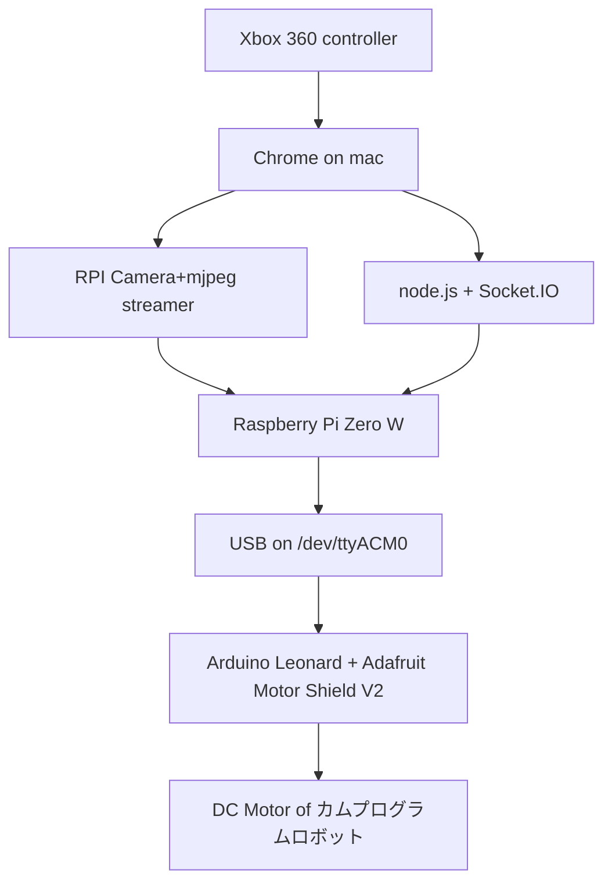

[タミヤ カムプログラムロボット](https://www.tamiya.com/japan/products/70227/index.html)を息子が組み立てた。
こいつをコンピュータからコントロール可能に改造し
親父のパワーを見せてやることにする。運動の類が全くできないので
こうするより他ないのである。
　（この記事は執筆中です）

## 構成（予定）

最終的にこうなる予定。無計画に部品を揃えた結果やむなしという構成でもあるが
好意的に解釈すれば、リモート通信・カメラ制御・コントローラ入出力などガチで
作り込むと手間がかかりそうな部分はPCに近いRPIにやらせつつ、Arduinoは
モーター制御に注力するというそれっぽい方針ともいえそうではある（と思いたい。。。）



## ①　Arduino LeonardからDCモータを取り敢えず動かす

- AdafruitのShieldを買うだけ。すごく楽。ただ、ピンヘッダの半田付け前に、よくよくAdafruitのガイドの写真を確認すること。（ピンヘッダの取り付け位置を誤るので）
  - [Install Adafruit Motor Shield V2 library](https://learn.adafruit.com/adafruit-motor-shield-v2-for-arduino/install-software)
- その後、Shield内のDCモータ用のM1／M2ピンをカムプログラムロボットのモータ２つの各々に繋ぐ
- 適当にサンプルスケッチをカスタマイズして投入すればいい

## ②　RPI+ArduinoをUSBケーブルで繋ぐ　＆ 開発環境を準備する

- この手順を用いる
  - [Raspberry PiでArduino IDEを使う](/2018/12/04/201812-rpi-arduino-ide/)
- なお、この時点でカムプログラムロボットのカム部分は外してしまい、RPI Zero W+Arduinoを載せてしまった
- 給電をどうするかが悩ましかったが、結局適当な5V+1A程度のモバイルバッテリーをRPIにつなぐだけで、今の所はRPI・Arduino・DCモータに全てに給電できている。RPIといってもZero Wを使ったおかげだと思う。おそらく何処かでうまく稼働しないタイミングが来るはずなので、その時にバッテリーを強くすることにする。

## ③　暫定で、簡単制御をやってみる＆カメラ映像を配信して、カムプログラムロボットだけで探検できるようにする

- Arduinoにはこんなスケッチを投入
  - これはつまり、シリアル入力をもらったら恐る恐る前／後や右回転／左回転をするもの
- RPI（ArduinoをUSBでつないだもの）へSSHログインし、ArduinoIDE（on RPI）を起動してからスケッチを投入する
- その後、SSHのコンソールでこんな風に入力して制御を始める
  - cu -l /dev/ttyACM0 -s 9600
  - a を入力ー＞左回転、d ー＞右回転、wー＞前進、sー＞後退
    - こちらの記事を見た。ありがたかった：[Raspberry PiとArduinoでシリアル通信](https://qiita.com/k_kinukawa/items/6eefb56c5c76863f7697)

```cpp
#include <Wire.h>
#include <Adafruit_MotorShield.h>

Adafruit_MotorShield AFMS = Adafruit_MotorShield(); 
Adafruit_DCMotor *myMotor = AFMS.getMotor(1);
Adafruit_DCMotor *myMotor2 = AFMS.getMotor(2);

void go() {
  uint8_t i;

  myMotor->run(FORWARD);
  myMotor2->run(FORWARD);
  for (i=0; i<255; i++) {
    myMotor->setSpeed(i);  
    myMotor2->setSpeed(i);  
    delay(5);
  }
  for (i=255; i!=0; i--) {
    myMotor->setSpeed(i);  
    myMotor2->setSpeed(i);  
    delay(5);
  }
  
  myMotor->run(RELEASE);
  myMotor2->run(RELEASE);

}

void back(){
  uint8_t i;

  myMotor->run(BACKWARD);
  myMotor2->run(BACKWARD);
  for (i=0; i<255; i++) {
    myMotor->setSpeed(i);  
    myMotor2->setSpeed(i);  
    delay(5);
  }
  for (i=255; i!=0; i--) {
    myMotor->setSpeed(i);  
    myMotor2->setSpeed(i);  
    delay(5);
  }
  myMotor->run(RELEASE);
  myMotor2->run(RELEASE);

}
void turnR() {
  uint8_t i;

  myMotor->run(FORWARD);
  myMotor2->run(BACKWARD);
  for (i=0; i<255; i++) {
    myMotor->setSpeed(i);  
    myMotor2->setSpeed(i);  
    delay(10);
  }
  /*
  for (i=255; i!=0; i--) {
    myMotor->setSpeed(i);  
    myMotor2->setSpeed(i);  
    delay(10);
  }
  */
  
  myMotor->run(RELEASE);
  myMotor2->run(RELEASE);

}
void turnL() {
  uint8_t i;

  myMotor->run(BACKWARD);
  myMotor2->run(FORWARD);
  for (i=0; i<255; i++) {
    myMotor->setSpeed(i);  
    myMotor2->setSpeed(i);  
    delay(10);
  }
  /*
  for (i=255; i!=0; i--) {
    myMotor->setSpeed(i);  
    myMotor2->setSpeed(i);  
    delay(10);
  }
  */
  
  myMotor->run(RELEASE);
  myMotor2->run(RELEASE);

}

void setup() {
  Serial.begin(9600);
  AFMS.begin();
  
  myMotor->setSpeed(150);
  myMotor->run(FORWARD);
  myMotor->run(RELEASE);
  myMotor2->setSpeed(150);
  myMotor2->run(FORWARD);
  myMotor2->run(RELEASE);
}

void loop() {
  char in;
  
  if (Serial.available()>0) {
    //in = Serial.readString();
    
    in = Serial.read();
    Serial.println(in);
    if (in == 'w'){
      Serial.println("GO!");
      go();
    }else if (in == 's'){
      Serial.println("BACK!");
      back();
    }else if (in == 'd'){
      Serial.println("RIGHT!");
      turnR();
    }else if (in == 'a'){
      Serial.println("RIGHT!");
      turnL();
    }else{
      Serial.println("ERROR: no match.");
    }
  }
  
  delay(50);
}
```

- 動くようになったので、mjpeg-streamerを入れてロボの目線から見える景色を眺めつつ、遠隔操作する
- こちらを参考にして導入し。。。
  - [Setup Guide: Raspberry Pi | MJPEG Streamer Install & Setup & FFMpeg Recording](https://github.com/cncjs/cncjs/wiki/Setup-Guide:-Raspberry-Pi-%7C-MJPEG-Streamer-Install-&-Setup-&-FFMpeg-Recording)
  - [Raspberry Pi zero wでストリーミング](http://gml.blog.jp/archives/7714805.html)
- こんなコマンドで起動する

```shell
/usr/local/bin/mjpg_streamer -i "input_raspicam.so -fps 15 -q 50 -x 640 -y 480" -o "output_http.so -p 9000 -w /usr/local/share/mjpg-streamer/www"
```

- 起動後、ブラウザでRPIの9000ポートでアクセスする
  - <http://rpihostname.local:9000/>

## ④　Xbox 360ゲームパッドをmacで使えるようにする

- こちらのドライバを活用させてもらう
  - [360Controller](https://github.com/360Controller/360Controller/releases)

## ⑤　Gamepad から Arduinoまでスムーズに入力がゆくようにする

この部分は次回以降に。。。

## 感想

正直シリアルで恐る恐るDCモーターを制御しているだけなのでモッサリ感がすごい。しかし、カメラのおかげでまるで火星探査機を操縦している雰囲気がある。これはこれでよさそうである。

## そのほか参考にさせていただいたサイト

- [USB端子から5ボルトを取る方法](http://tsukuru-hito.com/e3096596.html)
- [PROGRAM AN ARDUINO UNO WITH YOUR RASPBERRY PI](https://www.raspberrypi.org/magpi/program-arduino-uno-raspberry-pi/)
- [CONNECT RASPBERRY PI AND ARDUINO WITH SERIAL USB CABLE](https://oscarliang.com/connect-raspberry-pi-and-arduino-usb-cable/)
- [Raspberry Pi 3 の標準カメラで撮影した動画をブラウザに配信する方法まとめ](https://qiita.com/okaxaki/items/72226a0b0f5fab0ec9e9)
- [[GUIDE] Raspbian Lite with RPD/LXDE/XFCE/MATE/i3/Openbox/X11 GUI](https://www.raspberrypi.org/forums/viewtopic.php?t=133691)
