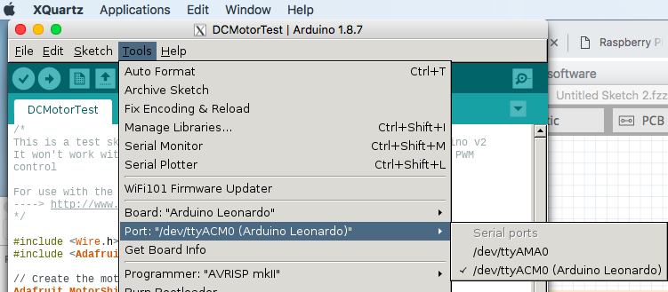

Raspberry Pi Zero W + Arduino で作ってみたいものがある。
ただ、わざわざSketchをPCから転送するのも面倒かつデバッグしにくい。。。。ので、Raspberry PiでArduino IDEを使えるようにしてみた。



## 目指す構成
Raspberry Pi/Arduino共に、コードを試行錯誤しやすい構成を目指す。Arduino IDEをRaspberry Pi上で動作させれば、macからリモートでRaspberry Pi/Arduinoいずれも開発ができて良さそうである。

        mac(OSX) 
            |
          [XWindow] on WIFI 
            |
        Raspberry Pi Zero W
            |
          [USB] on /dev/ttyACM0 
            |
        Arduino Leonard

## ① Raspberry Piのセットアップ
ディスプレイやキーボード無しでもやれるやり方のメモ
- [Raspbian (with Desktop)](https://www.raspberrypi.org/downloads/raspbian/)を入手
    - Liteではなく、Desktopがあるものを選ぶこと
- [Etcher](https://www.balena.io/etcher/)でMicro SDにRaspbianを焼く
    - [Micro SDはこれを使った](https://www.amazon.co.jp/gp/product/B01FTF7EH2)
    - Micro SDは[こういうメモリカードリーダー](https://www.amazon.co.jp/dp/B009D79VH4/ref=psdc_2151953051_t1_B006WEP0E4)に差してからUSBにつなぐ
- 事前にMicro SD内に、ssh有効化と、WIFIの接続情報を書いておく
    - ディスプレイやキーボードなしでセットアップするために
    - 焼いた後挿し直してから以下を実行
```shell
cd /Volumes/boot
touch ssh
vi wpa_supplicant.conf
#vi内で以下を投入して保存
country=JP
ctrl_interface=DIR=/var/run/wpa_supplicant GROUP=netdev
update_config=1
network={
    ssid="WIFIのSSID"
    scan_ssid=1
    psk="WIFIのパスワード"
}
```
- Micro SDをRaspberry Piに差して起動させる
- Raspberry PiのIPを探す
    - 暫くしたらWIFIにRaspberry Piが繋がっているはず。なので、こんな方法でIPを特定する
        - 方法①：自宅ルーターの接続情報などを見る。見慣れないIPがRaspberry Piのもの
        - 方法②：arp -a で見慣れないIPがおそらくRaspberry Piのもの
        - 方法③：一応仕組み上はmacから「ping raspberrypi.local」が通るはず。。。
    - sshで接続
```shell
ssh pi@raspberrypi.local
```
- 初期セットアップ諸々
    - sudo raspi-config と入力して以下設定を行う
        - change password
        - change hostname
        - change timezone
        - change locale
            - en_GB.UTF-8 を選び直しておいた（ja_JPにするとコンソールが日本語化されてエラーを踏みやすそうなので。。。）
        - enable Camera
        - expand filesystem

    - [WIFI接続が切れる問題対策]()

    - 再起動(sudo shutdown -r now)
    - sshの設定
        - keygenしてauthorized_keys作成
        - そのほか設定
            - port番号変更／rootログイン禁止/パスワードログイン禁止
        - 設定が終わったらsshd再起動(sudo /etc/init.d/ssh restart)
    - ipv6の無効化
        - すみません。。。
        - https://www.leowkahman.com/2016/03/19/disable-ipv6-raspberry-raspbian/
    - アップデート
        - sudo apt-get update
        - sudo apt-get upgrade
        - 再起動(sudo shutdown -r now)
    - 必要最低限の追加パッケージ
        - sudo apt-get install vim

