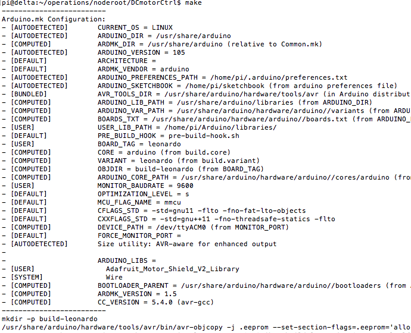

[以前]()、mac+XWindow経由でArduino IDEを使えるようにしたのでこれで開発をと考えていた。しかし、流石に遅くて辛い。さらにXQuartsに文字列をペーストするのもなかなかしっくりくる方法がなさそうなのでこれは見た目が派手なだけなので早々に諦めた。やっぱりコマンドラインが必要だ。




## 目指す構成
Raspberry Pi/Arduino共に、コードを試行錯誤しやすい構成を目指す。今度はカッコ良さげではない。実用第一で作る。

        mac(OSX) + vscode & SFTP plugin
            |
        Raspberry Pi Zero W
            |
          [USB] on /dev/ttyACM0 
            |
        Arduino Leonard

## ① Raspberry Pi Zero WとArduinoを接続
これはRaspberry Pi Zero WのUSBポートとArduinoを普通に繋げば良い。RPI側はOTGケーブルを使ったのだが、流石にモバイル機器じゃあるまいしということで普通のケーブルでもよいのじゃないだろうか。[USB Micro Bオス - USB Micro Bオス]の
ケーブルがあれば。。。

        RPI - [USB Micro B OTG Cable]
                    |
                    |
                    ---- [USB-A - Micro B] - Arduino

なお、この記事はQiitaの[この方の記事](https://qiita.com/RyodoTanaka/items/49df36f4cd95f8f9e939)を参考にした。
ありがとうございます。


## ② Arduino IDEをいれておく。
apt-getで入るVerは古いので、本家からARM用のバイナリを、Download & Uploadする。コマンドライン編といいつつ、こいつを入れるのはLibraryManagerが使いやすいから。。Libraryを持ってくるときだけはXWindowでいれるのである。（志が低くてすみません。）

- [こちらを参照]()

## ③ Arduino-mkを入れる
Raspberry Piのターミナルで実行
```
sudo apt-get install arduino-mk
```

## ④ vscodeにsftp(ファイル同期プラグイン)を入れる
これが使いやすい。これを入れてから、「Ctrl+Shift+P」 on Windows/Linuxか「Cmd+Shift+P」 on Macでコマンドパレットを開き、「SFTP: config」コマンドを選択してからでてくる設定画面で適宜設定する。

- 入れるのはこれ[sftp](https://marketplace.visualstudio.com/items?itemName=liximomo.sftp)
- 入れた後で、ワークスペースをつくり、フォルダを追加しておく
- その後、「Ctrl+Shift+P」 on Windows/Linuxか「Cmd+Shift+P」 on Macでコマンドパレットを開き、「SFTP: config」コマンドを選択。設定画面が開く
- その後私はこんな設定を突っ込んだ。これでワークスペース内のファイルは保存するたびにRPIに自動的にvscodeが上げてくれる。以下、 「SFTP: config」コマンドを選択してでてくる設定画面
```
{
    "protocol": "sftp",
    "host": "ラズパイのホスト名",
    "port": 22,
    "username": "pi",
    "remotePath": "ラズパイ内のモジュールの置き場所",
    "privateKeyPath": "SSH秘密鍵の場所＠手元のPC",
    "passphrase": "SSH秘密鍵のパスフレーズ",
    "uploadOnSave": true
}
```

## ⑤ 適当にinoファイルとMakefileをつくる
理由はよくわからないが、inoファイルはファイル名と同じフォルダでなくてはならないそうなので、そうする。（Arduino IDEからそうしろと言われる）また、Makefileもつくる。こんなフォルダ構成で。

        SampleIno
          |
          |--- SampleIno.ino
          |--- Makefile

Inoはどこぞのサンプルなどを持ってくることにして、Makefileはこんなふうにする。
- BOARD_TAGはご自分のArduinoに合わせる。BOARD_TAG　Arduino名で検索するとでてくる
- USER_LIB_PATHはきっとここ決め打ちでいいだろう
- ARDUINO_LIBSはよくわからないが「/home/pi/Arduino/libraries/」か「/usr/share/arduino/libraries」の使いたいライブラリのフォルダ名を書けば良さそう
```shell
BOARD_TAG           = leonardo
MONITOR_PORT        = /dev/ttyACM0
MONITOR_BAUDRATE    = 9600
USER_LIB_PATH      += /home/pi/Arduino/libraries/
ARDUINO_LIBS       += Adafruit_Motor_Shield_V2_Library Wire
include /usr/share/arduino/Arduino.mk
```

## ⑥ SSHにログインして、make upload
するとコンパイルが行われたのち、Arduinoにコードが叩き込まれる。便利！
```
cd Makefileのあるディレクトリ
make upload
```

vscodeで編集 -> Ctrl-s -> Termimnalにうつって -> カーソルキー上Enterでガンガンかけるのは嬉しい。ArduinoだけじゃなくRPI上のnodejsのプログラムもガンガン更新されるわけだし。。。

## 感想
個人レベルだとこんなもんで随分と嬉しいものである。
ま、低レベル中の低レベルでもDeployはコマンド一発にできるといいもんだとは体感できた。レポジトリにコミットすると自動Deployみたいに
さらにシステム化するともっと気分がいいんだろう。今後も満足せずにもっとよくしたい。
