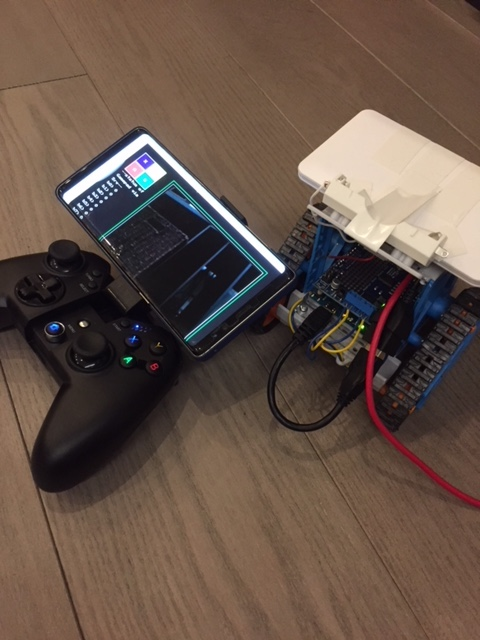
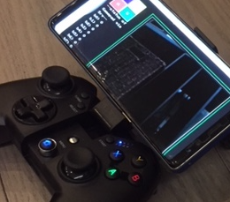

[前々回](https://metaproxy.co/gamepad/)
はjavascriptでゲームパッドの入力の取得に成功し、
[前回](https://metaproxy.co/gamepad2nd/)
はそいつをWebsocketでNodejsのサーバへ入力することに成功した。

最終回の今回は、そいつをさらにArduinoへ投入し、
[別口](https://metaproxy.co/tamiyarobot/)
でつくっておいたタミヤカムプログラムロボットをゲームパッドからワイヤレスで制御することにする。



## はじめに言い訳
なお、別口と申し上げたが、実はこの別口こそが本来の本筋であって本来このエントリは「タミヤ カムプログラムロボットを改造 その２」のはずであった。。

個人ブログで適当に書き進めていたせいか、二つのエントリの続きなのである。二つの記事からの続きなんて、雑誌などではあり得ないが
まぁご容赦いただきたい。

## 作ったものの構成

結局こういう構成になった。

        Android対応のGamepad（無線／端末をマウントできるもの）
            |
          Firefox (on Android)
            |
            |-------------------------------
            |                              |
        [RPI Camera+mjpeg streamer]   [node.js + Socket.IO]
            |                              |
            |-------------------------------
            |
        Raspberry Pi Zero W
            |
         [USB] on /dev/ttyACM0
            |
        Arduino Leonard + Adafruit Motor Shield V2
            |
        DC Motor of カムプログラムロボット


最初macにコントローラを繋いだのだが、有線なので
未来感がなかったのか、いまいち息子の支持を得られなかった。。。

これではまずいということで、Android用のGamepadを購入した。最近は端末をマウントできるものがあって、これがあるとすごくロボットの
コンソールっぽいのである。


案の定息子の心に火をつけることに成功。
ただ、モバイルのChromeはGamepadAPIを未実装なのか動かなかったのでFirefoxを導入した。

余談だが、なんだかEdgeがなくなることとか、こういう、Chromeではやってくれない部分の対応の速さをみると、やっぱりFirefoxみたいな挑戦者はいつでも必要だよな。。。と思い直し、最近言いふらしていた「立ち位置的にはopenソース化前のCommunicator化してきている」などどいう偏見に基づく悪口を言うのをやめることにした。


## ①　まずは開発環境作りから。。。

[以前]()、mac+XWindow経由でArduino IDEを使えるようにしたのでこれで開発をと考えていた。しかし、流石に遅くて辛い。さらにXQuartsに文字列をペーストするのもなかなかしっくりくる方法がなさそうなのでこれは見た目が派手なだけであった。なので早々に諦めた。

- かわりに[この記事のやり方で]()こういう構成をつくった
  - vscode + sftpで手元のコードをRPIへ自動アップロード
  - make uploadでArduinoにスケッチを叩き込む
- なお、Arduinoの他、ゲームパッドの入力を受けるのにnodejs+Socket.IO(WebSocket)を
つかったが、その準備はこうすればいい
```shell
mkdir noderoot
cd noderoot
git clone https://github.com/creationix/nvm.git ~/.nvm
source ~/.nvm/nvm.sh
nvm install 8.9.4
npm install socket.io
npm install express
```


## ②　次に、カムロボットとか、カメラでの映像配信を準備する

[タミヤ カムプログラムロボットを改造 その１]()でやったように準備する。

## ③　プログラムを準備する＜１：Gamepad->RPI＞

ポイントは、ふたつ。

ひとつはゲームパッドの入力をどうやって楽にWebSocketでRPIへ突っ込むかということ。いくらWebSocketとはいえ、ボタン一つ一つの入力を送りあってたらキュー制御みたいなことが必要になりそうだ。ということで、JSONをつくって、それをnodejsでParseすることにする。

こういう風にJSONをクライアント側でつくって
```javascript
    function pickGPtoJSON(gp){
        var bi;
        var json = {};
        for( bi=0; bi < gp.buttons.length; bi++ ){
            json["b"+bi] = gp.buttons[bi].value;
        }
        for( bi=0; bi < gp.axes.length; bi++ ){
            json["a"+bi] = gp.axes[bi];
        }
        return json;
    }
```

nodejs側でこういう風にParseする
```javascript
  var parsedGP = JSON.parse(gp);
```

JSONをすんなり作る方法がなかなか検索してもなかったが、この
方々の記事がわかりやすく助かった。
- http://kazumarr.hatenablog.com/entry/javascript_
- https://www.digitalocean.com/community/tutorials/how-to-work-with-json-in-javascript


## ③　プログラムを準備する＜２：RPI->Arduino＞

ふたつめのポイントは、nodejsが受け取ったゲームパッドをどうやってArduinoが溢れないように渡してやるかである。

ゲームパッドの入力は60fps出せるrAF(requestAnimationFrame)
＋WebSocketでガンガンRPIに突っ込まれる。これに対しRPI->Arduinoはシリアル通信、つまり9600bps=1.2byte/milsec
くらいなのである。

どう考えても真っ正直に突っ込むと通信が間に合わないので、２つの作戦を考えた
- RPI->Arduinoへのデータ投入には** インターバル(100msecにした) **を入れる
- RPI->Arduinoへのデータ投入はゲームパッドの入力を** 1byte **にまとめて文字列ではなくビットフィールドで入れる

つまりこういう感じにする。1Byteのバイト型の変数を作りボタンが押されてたらOR演算でビットを立てていくわけである。それを最低100msecまってから投入してゆく。
　（OR演算などと偉そうに書いたが、砂場で棒を並べるのと本質的には同じ操作である。。。）

```javascript
function buildByteGP(gp){
  /*
  [bit assignment]
   FORWARD  -> 1000 0000 -> 0x80
   BACKWARD -> 0100 0000 -> 0x40
   LEFT     -> 0010 0000 -> 0x20
   RIGHT    -> 0001 0000 -> 0x10
   STOP     -> 0000 0001 -> 0x01

  [gamepad key assignment]
   a1 -->> -: forward, +:backward
   a2 -->> -: left,    +:right
   b6+b7-> FORCE STOP
  */
  var buf      = new Buffer(1);
  var parsedGP = JSON.parse(gp);
  buf[0] = 0x00;

  if ( parsedGP.a1 <= -0.8 ) {
    buf[0] = buf[0] | 0x80;
  } else if( parsedGP.a1 >= 0.8 ) {
    buf[0] = buf[0] | 0x40;
  }
  if ( parsedGP.a2 <= -0.8 ) {
    buf[0] = buf[0] | 0x20;
  } else if( parsedGP.a2 >= 0.8 ) {
    buf[0] = buf[0] | 0x10;
  }

  //Force STOP
  if ( (parsedGP.b6 == 1) & (parsedGP.b7 == 1) ){
    buf[0] = 0x01;
  }
  return buf;
　}
  socket.on('gpFromClient', function(msg){
    var buf;
    io.emit('gpFromSrv', msg);
    if ( (Date.now() - last) >= interval ){
      last = Date.now();
      buf  = buildByteGP(msg)
      console.log("-> emit:" + last + ">" + buf.toString('hex'));
      sp.write(buf);
    }
  });
```

なお、Byte列をnodejsで作る方法は、StackoverflowのこちらのQ&Aがわかりやすかった
- [Sending bytes to serial port using Node.js](https://stackoverflow.com/questions/26068550/sending-bytes-to-serial-port-using-node-js)


## ④　プログラムを準備する＜３：ArduinoでSerialから値受け取りと、DCモーター制御＞

正直、DCモータの制御は酷い感じがする。ので特に解説はできないが
ひとまずは速度を示すdrive/drive2が正ならば前に進むようにまわし
負ならば後ろに進むように回す。

これをSerialからの入力に応じて、前・後・右回転・左回転
になるようにやったつもりだがなにか根本的に間違っている気がする。

前後回転も一応できるのだが、思った通りではない。
ここは継続調査するがひとまず、動かして先へ進む。

Serialからの値の取り出しはnodejsの時とは逆に
AND演算で取り出していけばいい。

```cpp
void loop() {
  uint8_t in = false;

  //Retrieve Gamepad info from Raspberry Pi
  if (Serial.available()>0) {
    in = Serial.read();
    Serial.flush();
    if( in ){
      Serial.write(drive);
      Serial.write(drive2);
      gp = in;
      in = false;
    }
  }
  
  //Calc. each DC motor speed
  // based on bit assignment of Gamepad.
  /*
  [bit assignment]
   FORWARD  -> 1000 0000 -> 0x80
   BACKWARD -> 0100 0000 -> 0x40
   LEFT     -> 0010 0000 -> 0x20
   RIGHT    -> 0001 0000 -> 0x10
   STOP     -> 0000 0001 -> 0x01

  [gamepad key assignment]
   a1 -->> -: forward, +:backward
   a2 -->> -: left,    +:right
   b6+b7-> FORCE STOP
  */
  if( gp & 0x80 ){ //FORWARD
    if( drive  < 127 ){ drive++; }
    if( drive2 < 127 ){ drive2++; }
  }
  if( gp & 0x40 ){ //BACKWARD
    if( drive  > -127 ){ drive--; }
    if( drive2 > -127 ){ drive2--; }
  }
  if( gp & 0x20 ){ //RIGHT
    if( drive  > -127 ){ drive--; }
    if( drive2 <  127 ){ drive2++; }
  }
  if( gp & 0x10 ){ //LEFT
    if( drive  <  127 ){ drive++; }
    if( drive2 > -127 ){ drive2--; }
  }
  if( gp & 0x01 ){ //FORCE STOP
    drive  = 0;
    drive2 = 0;
  }
  //and just RUN.
  runM();

  delay(5);
}
```


## ⑤　プログラムを準備する＜４：mjpeg-streamerの表示＞

上記までで制御部分はできた。最後に、カメラ映像を表示するために、
port:9000でmjpeg-streamerが待ち受けている。

これをport:3000で動く自作のコンソールに統合する必要がある。本来なら単純にimgタグ＋相対Pathで読み込めばいいのだが、別Portなので相対Pathがつかえない。なので、imgタグを準備した上で、javascriptで定期的に読み込んでやることにする。こんな風に

```html
    <script>
    function loadMjpgImg(){
        $("#camera").attr('src',"http://"+location.hostname+":9000/?action=snapshot");
    }
    $(document).ready(function() {
        lp2 = setInterval(loadMjpgImg, 200);;
    });
    </script>
        
```

## ⑥　いよいよ組み合わせる時が来た

起動用バッチを準備し、起動する。このstart.shは/etc/rc.localに追記しておき
起動したら勝手に立ち上がるようにしておく。

```shell
#!/bin/bash
mjpg_streamer -i "input_raspicam.so -fps 10 -q 10 -x 640 -y 480" -o "output_http.so -p 9000 -w /home/pi/operations/mjpg-streamer/www" &
/home/pi/.nvm/versions/node/v8.9.4/bin/node /home/pi/operations/noderoot/DCconsoleSrv.js &
```

AndroidにFirefoxを入れ、Bluetoothのゲームパッドを接続してからFirefoxで<http://RPIのポート:3000>にアクセスすればこういうふうに動かせる。
```html
<iframe width="560" height="315" src="https://www.youtube.com/embed/qTPEKqwHLSE" frameborder="0" allow="accelerometer; autoplay; encrypted-media; gyroscope; picture-in-picture" allowfullscreen></iframe>
```

## 感想

正直、ロボットの制御がこんなに面白いものだとは知らなかった。たくさんの技術者がロボットの道に進むわけである。とにかく動かしているだけで楽しい。
そして、その実装はわずかな半田付けと、Web/サーバ運用の技術、それから「はじめてのC」レベルの実装でいける世の中になっているのである。私のようなフルスタックと言うか寄せ集めのゴミスタックエンジニアでも十分に遊べる。いい世の中になったもんだ。

なお、はじめにArduino Leonardo, Adafruit Motor Shield V2を買ってから構成を考えたので、随分とGamepadとのの接続部分を回りくどくしてしまった、と途中で後悔もした。
WebSocket on ブラウザ  + Nodejs on RPI + Serialの３つも噛ませてあるのだ。


しかし、終わってみればリアルタイム入力をうまく高速かつ柔軟なRPI側でさばき、適度に加減してArduinoに渡せる構成なのではないか、もしかしたらカメラ入力を機械学習＠クラウド側に渡してもっと素敵なことができるのではないか、など拡張性もある構成なのではないかと、自画自賛しておこう。

## Appendix. コード全部


### DCconsoleSrv.js
```javascript

var app  = require('express')();
var http = require('http').Server(app);
var io   = require('socket.io')(http);
var SerialPort  = require('serialport');
var sp = new SerialPort('/dev/ttyACM0', {
  baudRate: 9600,
  dataBits: 8,
  parity: 'none',
  stopBits: 1,
  flowControl: false
});

var interval = 100; //ms
var last = Date.now();

function buildByteGP(gp){
  /*
  [bit assignment]
   FORWARD  -> 1000 0000 -> 0x80
   BACKWARD -> 0100 0000 -> 0x40
   LEFT     -> 0010 0000 -> 0x20
   RIGHT    -> 0001 0000 -> 0x10
   STOP     -> 0000 0001 -> 0x01

  [gamepad key assignment]
   a1 -->> -: forward, +:backward
   a2 -->> -: left,    +:right
   b6+b7-> FORCE STOP
  */
  var buf      = new Buffer(1);
  var parsedGP = JSON.parse(gp);
  buf[0] = 0x00;

  if ( parsedGP.a1 <= -0.8 ) {
    buf[0] = buf[0] | 0x80;
  } else if( parsedGP.a1 >= 0.8 ) {
    buf[0] = buf[0] | 0x40;
  }
  if ( parsedGP.a2 <= -0.8 ) {
    buf[0] = buf[0] | 0x20;
  } else if( parsedGP.a2 >= 0.8 ) {
    buf[0] = buf[0] | 0x10;
  }

  //Force STOP
  if ( (parsedGP.b6 == 1) & (parsedGP.b7 == 1) ){
    buf[0] = 0x01;
  }
  return buf;
}

app.get('/', function(req, res){
  if(req.url == '/favicon.ico'){
    return;
  }
  res.sendFile(__dirname + '/DCconsole.html');
});
io.on('connection', function(socket){
  console.log('[user connected]');
  socket.on('disconnect', function(){
    console.log('[user disconnected]');
  });
  socket.on('gpFromClient', function(msg){
    var buf;
    io.emit('gpFromSrv', msg);
    if ( (Date.now() - last) >= interval ){
      last = Date.now();
      buf  = buildByteGP(msg)
      console.log("-> emit:" + last + ">" + buf.toString('hex'));
      sp.write(buf);
    }
  });
});

sp.on('data', function(msgFromA){
  var buf = new Buffer(msgFromA);
  console.log('  <- data from Arduino+: ' + buf.toString('hex') );
});

http.listen(3000, function(){
  console.log('listening on *:3000');
});
```

### DCconsole.html
```html
<!DOCTYPE html>
<html>
<head>
    <meta charset="utf-8">
    <script src="/socket.io/socket.io.js"></script>
    <script type="text/javascript" src="http://ajax.googleapis.com/ajax/libs/jquery/2.1.0/jquery.min.js"></script>
      <style>
@import url('https://fonts.googleapis.com/css?family=Press+Start+2P');
body{
  color: rgba(255,255,255,.75);
  font-family: 'Press Start 2P', cursive;
  background-color: rgb(25,25,25);
  font-size: 1.0em;
  padding: 2.0em;
  line-height: 1.8rem;
}
.buttons{
}
.button{
  background-color: #4CAF50;
  border:rgba(255,255,255,.75) solid;
  color: white;
  padding: 15px 32px;
  text-align: center;
  text-decoration: none;
  display: inline-block;
  font-size: 16px;
}
.bb {
  background-color: rgb(39, 28, 192); 
}
.by {
  background-color: rgb(241, 255, 44); 
  border-top:rgba(255,255,255,.75) solid;
}
.br {
  background-color: rgb(247, 68, 68); 
}
.bg {
  background-color:  #4CAF50;
}
.parent {
  display: flex;
  justify-content:left;
}
.child1{
    width: 1000px;
}
.child2 {
    border: rgb(248, 45, 45) solid;
    border: #4CAF50 solid;
    padding:10px;
    font-size: 90%;
}

form input {
    color: rgba(255,255,255,.75);
    font-family: 'Press Start 2P', cursive;
    background-color: rgb(25,25,25);
    font-size: 1.0em;
    padding: 2.0em;
    line-height: 1.8rem;
    border: 0; padding: 10px; 
    border-top:rgba(255,255,255,.75) solid;
    border-left:rgba(255,255,255,.75) solid;
    border-bottom:rgba(255,255,255,.75) solid;

}
form button {
    color: rgba(255,255,255,.75);
    font-family: 'Press Start 2P', cursive;
    background-color: rgb(224, 34, 81);
    font-size: 1.0em;
    padding: 2.0em;
    line-height: 1.8rem;
    border: 0; padding: 10px; 
    border-top:rgba(255,255,255,.75) solid;
    border-right:rgba(255,255,255,.75) solid;
    border-bottom:rgba(255,255,255,.75) solid;
}


    </style>
</head>
<body>
<script>
    function setMessage(selector,text) {
        $(selector).html(text);
    }
    function addMessage(selector,text) {
        $(selector).html($(selector).html()+"<br/>"+text);
    }
    function invertColors(elem) {
        var color = $(elem).css('color');
        $(elem).css('color') = $(elem).css('background-color');
        $(elem).css('background-color') = color;
    }
    function pickGPtoJSON(gp){
        var bi;
        var json = {};
        for( bi=0; bi < gp.buttons.length; bi++ ){
            json["b"+bi] = gp.buttons[bi].value;
        }
        for( bi=0; bi < gp.axes.length; bi++ ){
            json["a"+bi] = gp.axes[bi];
        }
        return json;
    }

    function loadMjpgImg(){
        $("#camera").attr('src',"http://"+location.hostname+":9000/?action=snapshot");
    }
    function mainLoop(){
        var bi;
        var gp = navigator.getGamepads()[0];
        if (gp) {
            socket.emit('gpFromClient', JSON.stringify(pickGPtoJSON(gp)));
        }
        lp = raf(mainLoop);
    }

    var gp = false;
    var lp;
    var raf  = window.requestAnimationFrame || window.mozRequestAnimationFrame || window.webkitRequestAnimationFrame || window.msRequestAnimationFrame;
    var rafS = window.mozCancelRequestAnimationFrame || window.webkitCancelRequestAnimationFrame || window.cancelRequestAnimationFrame;
    var lp2;
    var socket;
    var parsedMsg;
    $(document).ready(function() {

        window.addEventListener("gamepadconnected", function(e) {
            gp = navigator.getGamepads()[e.gamepad.index];
            addMessage("#console","[NAME:"+ gp.id +"], [# OF BUTTONS:"+gp.buttons.length+"], [# OF AXES:"+gp.axes.length+"]");
            mainLoop();
        });
        window.addEventListener("gamepaddisconnected", function(e) {
            gp = false;
            addMessage("#console","connection terminated");
            rafs(lp);
        });
        
        socket = io();
        socket.on('gpFromSrv', function(msg){
            var bi;
            parsedMsg = JSON.parse(msg);
            setMessage("#status","--status of Gamepad via Srv--")
            Object.keys(parsedMsg).forEach(function (key) {
                addMessage("#status", key + "> " + parsedMsg[key] );
            });
        });
        
        lp2 = setInterval(loadMjpgImg, 200);;
    });
</script>
<div class="parent">
<div class="child1">
        <div class="buttons">
                <span id="btnX" class="button bb">X</span><span id="btnX" class="button by">Y</span><span id="btnX" class="button br">A</span><span id="btnX" class="button bg">B</span>
        </div>
                <span id="status">---status-------<br/>
                b:0> -:-<br/></span>
</div>
<div class="child2">
        
        <form id="frmMes" action="">
          <input id="m" autocomplete="off" /><button>Send</button>
        </form>
            <span id="console">console<br/>------------------------------------<br/></span>
</div>

</body>
</html>
```

### DCmotorCtrl.ino
```cpp
#include <Wire.h>
#include <Adafruit_MotorShield.h>

Adafruit_MotorShield AFMS = Adafruit_MotorShield(); 
Adafruit_DCMotor *myMotor = AFMS.getMotor(1);
Adafruit_DCMotor *myMotor2 = AFMS.getMotor(2);

int8_t  drive   = 0; //stop state
int8_t  drive2  = 0; //stop state
uint8_t gp     = false; 

void runM(){
  uint8_t t;

  if( drive == abs(drive) ){
    myMotor->run(FORWARD);
  }else{
    myMotor->run(BACKWARD);
  }
  if( drive2 == abs(drive2) ){
    myMotor2->run(FORWARD);
  }else{
    myMotor2->run(BACKWARD);
  }

  t=abs(drive) *2; myMotor->setSpeed(t);
  t=abs(drive2)*2; myMotor2->setSpeed(t);

  //myMotor->run(RELEASE);
  //myMotor2->run(RELEASE);
}

void setup() {
  Serial.begin(9600);
  AFMS.begin();
}

void loop() {
  uint8_t in = false;

  //Retrieve Gamepad info from Raspberry Pi
  if (Serial.available()>0) {
    in = Serial.read();
    Serial.flush();
    if( in ){
      Serial.write(drive);
      Serial.write(drive2);
      gp = in;
      in = false;
    }
  }
  
  //Calc. each DC motor speed
  // based on bit assignment of Gamepad.
  /*
  [bit assignment]
   FORWARD  -> 1000 0000 -> 0x80
   BACKWARD -> 0100 0000 -> 0x40
   LEFT     -> 0010 0000 -> 0x20
   RIGHT    -> 0001 0000 -> 0x10
   STOP     -> 0000 0001 -> 0x01

  [gamepad key assignment]
   a1 -->> -: forward, +:backward
   a2 -->> -: left,    +:right
   b6+b7-> FORCE STOP
  */
  if( gp & 0x80 ){ //FORWARD
    if( drive  < 127 ){ drive++; }
    if( drive2 < 127 ){ drive2++; }
  }
  if( gp & 0x40 ){ //BACKWARD
    if( drive  > -127 ){ drive--; }
    if( drive2 > -127 ){ drive2--; }
  }
  if( gp & 0x20 ){ //RIGHT
    if( drive  > -127 ){ drive--; }
    if( drive2 <  127 ){ drive2++; }
  }
  if( gp & 0x10 ){ //LEFT
    if( drive  <  127 ){ drive++; }
    if( drive2 > -127 ){ drive2--; }
  }
  if( gp & 0x01 ){ //FORCE STOP
    drive  = 0;
    drive2 = 0;
  }
  //and just RUN.
  runM();

  delay(5);
}
```


