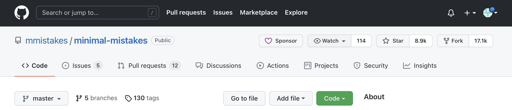
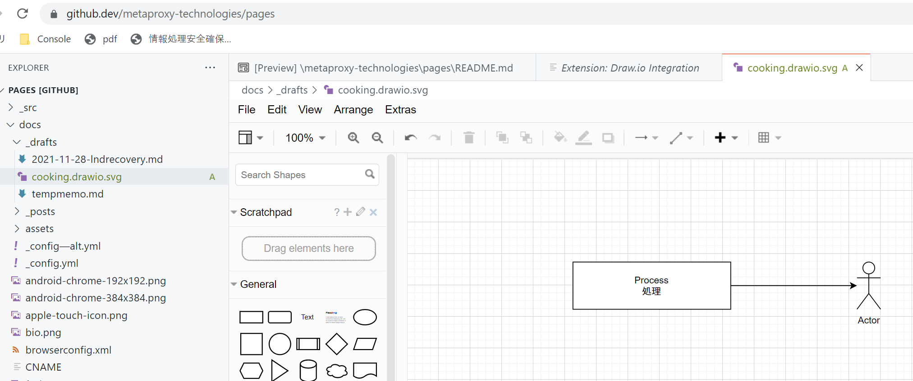
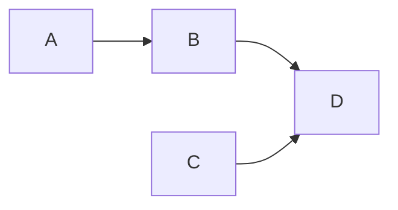

動的に記事が追加編集可能で、でも出力は静的なwordpress代替をgithub pagesで試してみました。

## 背景

動的なCMSは便利ですが、update時に本番が死んでしまう不安が常にあります。実際、お問合せフォームが死んだりレイアウトが崩れたり結構な割合でしますから、本番にあてる前にテスト環境へ適用し稼働を確認することになります。一方、最近の脆弱性のExploitは結構速度が速くなってきていますから、できればupdateは即実施したいところですがままなりません。

静的htmlすることができれば前述の不安はありませんが、例えば静的CMSを用いるとカスタマイズの結果は記事を更新するユーザのデスクトップにありますから、結局ビルド環境を構築したデスクトップについて、前述の本番サーバのような扱いが必要になってきてしまいます。大抵不安を抱えつつ恐る恐る日常使用することになります。

このような課題をgithub pagesを用いて解消できないか試験してみることにします。

## github pagesの特徴

### テーマ多数。カスタマイズ可能
jekyllという静的CMSからgithubがページ生成してくれます。一見テーマカスタマイズ不可に見えますが、テーマをgithub上でforkしてからカスタマイズすることができます。どこかに限界があるんだと思いますが。。。

### githubのrepositoryからwebsiteを自動生成
- repository上にマークダウンを配置してcommitすると自動でビルド
- 戻しもマークダウンを戻すだけ
- 自動ビルドに失敗してもページが壊れない。エラー修正してからcommitすれば改めてビルド
- 独自ドメインを割り当て可能

### 複数人で更新可能
webpageの元は当然github上のただのマークダウンですから、通常通りcloneしてpushすれば更新できます
 (一人で運営しているから私はメリットは享受できませんが。。)

### vscodeでブログ更新可能
レポジトリ上で「.」を押下すればブラウザ上でvscodeが立ち上がります。編集が自由自在です。また、drawioのプラグインを用いると図の作成もブラウザ上で完結できます。

## 利用してみて
ずいぶんと悪くない使用感です。

このブログはminimal mistakeというテーマをforkしてカスタマイズしたものを使っています。

- ブログのレポジトリ <https://github.com/metaproxy-technologies/pages>
- ブログが利用しているテーマ(forkしてカスタマイズしたもの)<https://github.com/metaproxy-technologies/minimal-mistakes>


## 作り方(概略)

このように作ります
- github pagesのチュートリアルを行う
- repositoryを作り試しに公開してみる
- テーマを設定する
    - github pages組込のテーマ使う
    - 独自テーマを使う/カスタマイズする
- 独自ドメインを割り当てる
- repositoryを非公開にする（非公開としたければ）

詳しくはこちらの公式を読み進めてみてください
<https://docs.github.com/ja/pages/getting-started-with-github-pages/about-github-pages>

## 作り方の補足<1>

当初テーマのカスタマイズ方法が不明でした。皆さんローカルに持ってきてビルド環境を作っている方が多かったので、同様にすれば可能という事はわかったんですが、github pagesの利点はローカルにビルド環境を作らないことが利点と考えていましたから、そうならないように調査するために時間を要しました。

このようにすることでローカル環境無しにカスタマイズができます
- 使いたいテーマをforkし、変更を加えたい箇所を変更する

- _config.ymlでforkしたテーマのリポジトリを指定する
    - theme: ではなく remote_theme: で指定する

```yaml
remote_theme: metaproxy-technologies/minimal-mistakes
plugins:
  - 他のプラグイン
  - jekyll-remote-theme
```

- ブログ側のrepositoryを更新して反映する

## 作り方の補足<2>

github.dev & [drawio](https://github.com/philip-gai/github-drawio-demo)を使って図を作成し埋め込むことも可能です。

githubのレポジトリ上にソースはあるので、このようにします
- レポジトリ上で「.」を押してブラウザ上のvscode起動
- drawioで図を描く
- マークダウンに埋め込む

### ブラウザ上で編集しているところ
純粋に図をつくることももちろん可能ですが


このようにスクリーンショットに注釈を加えることもできます。Windows-Shift-S押下後に画面をクリップボードに切り取り、vscode上で.drawio.svgのファイルを作り、Ctrl-Vで張り付けてから編集します


### 作って埋め込んだ図


詳しくはブログ用のレポジトリ作成後にこちらを参照
<https://github.com/philip-gai/github-drawio-demo>

## 作り方の補足<3>

markdownだけで図がかけたほうが簡便ですから、mermaidも埋め込めるようにしました。
テーマに埋め込むと、mermaid記法で図が書けるようになります。 



埋め込み方は<https://qiita.com/fumitoh/items/ff28e0720ab0ebc84e96>をご覧ください。

## 最後に
ご紹介しましたが、構築するPageによってはgithub pagesでWebpageを作ることの是非はあると考えています。プロダクトのページを作るのが本命なのだと思います。技術に関連しないPageの構築をお考えの方は、github pagesの規約を熟読することをお勧めいたします。

