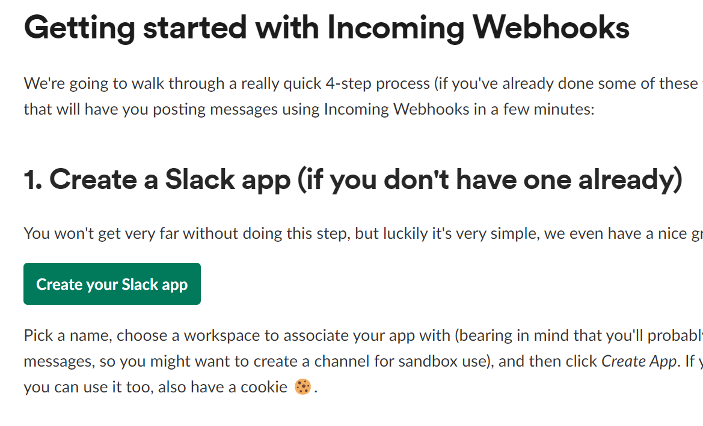

サーバ内のイベントをSlackへ通知するための簡易メモです。

## はじめに：どういうイベントが対象になるか

発生ー＞即インシデント　のような異常系のイベントについては、これは当然行動に移して対応する必要がありますから、メールや人間によるコールなど、処理しないといつまでも残り続けるものである必要があると思います。

一方、例えば週一回程度や月一回程度、正常に進んでいることを確認すればよいようなものもあろうかと思います。

このあたりいつも監視設計をすると結局メールBOXに流し込んだうえで何となく日々眺めるか、もしくは行動がないのだから受信すらしないという形に落ち着いていると思いますが、Slackに流し込んでみて監視がどのようになるのか試験してみたいと思います。


## 仕組み

サーバ内の通知を一度メールとして集め、集めたメールをWebhook経由でSlackのChannelへ送付します。


## 仕掛け方

### postfixを導入します。
<https://www.digitalocean.com/community/tutorials/how-to-install-and-configure-postfix-as-a-send-only-smtp-server-on-ubuntu-20-04>

### 各種サービスの通知をメールでどこかに集めます
いったん<root@locakhost>などに集約してしまってよいと思います。歴史的にメールで通知することが多かったので、たいていのサービスはメールで通知することができます（ただでさえrootには何かとお知らせが集まってくるので）

### Slackでチャネルを作り、WebHook受付用のURLを作ります
"Incoming Webhook"と呼ばれているそうです。こちらのガイドに従ってSlackのAppをつくると、そのURLを発行することができます。
<https://api.slack.com/messaging/webhooks>

いろいろと記載がありますが、"Create your Slack app"ボタンをいきなり押してから、各ページにあるガイドに従ってゆくと特に苦労なく作ることができます。


### メール転送用のシェルスクリプトをつくります

たとえばuserAのhomeに、パイプで受け取った入力をSlackのWebhookへ叩き込むようなスクリプトを作成します
```shell
vi /home/userA/notify.sh
```

```shell
#!/bin/bash

#URLはこのようなものです
#  "https://hooks.slack.com/services/XX12345789/XXX12345678/abcd1253745489124"
URL="先ほど作成したWEBHOOKのURL"  
LF=$'\n'

concat=""
while read line
do
    concat=$concat$line$LF
done

curl -X POST \
  -H 'Content-type: application/json' \
  -d '{"text":"'"$concat"'"}' \
  $URL
```

### /etc/aliasesを編集し、メールを先ほど作ったScriptへ転送します

```shell
sudo vi /etc/aliases
```

このように、各種通知をrootへ集めたのちに、先ほど作成した「/home/userA/notify.sh」へパイプで渡します

```shell
#/etc/aliasesの中身
# /etc/aliases
postmaster: root
root: "| /home/userA/notify.sh"
```

編集後にaliasesのDBを作り直します
```shell
sudo newaliases
```

### メールを作ってテストします

mailコマンドでrootへメールを投入します
```shell
 echo "This is the body of the email" | mail -s "This is the subject line" root@localhost
```

いけましたね


