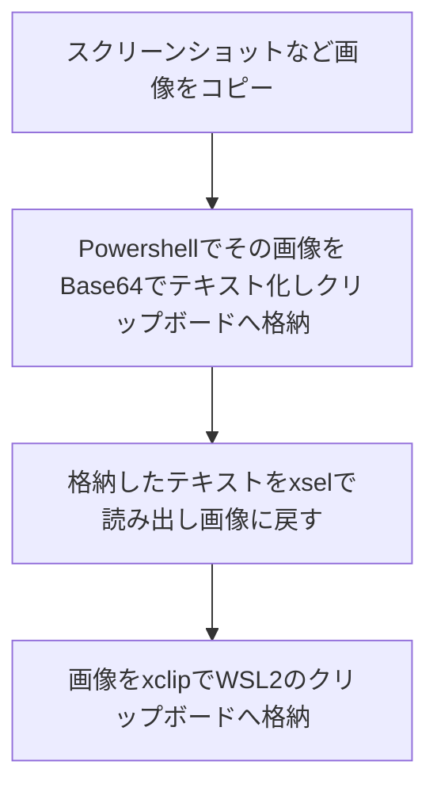
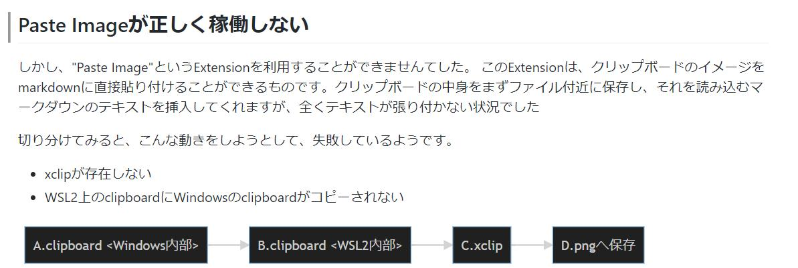

Paste ImageをWSL2で利用する方法です。
利用する道は見つかりましたが、これならばPNGへ保存したものを素直にmarkdownへ書いた方がよいと思います。
別のやり方を模索したいところです。

## 実施したいこと

gitへの接続設定がWindowsとWSL2内部で分散することを避けつつ
vscodeでこういうことを試みました。


vscodeでwsl2上のgitレポジトリを編集しようとしたのが始まりでした。普段WSL2上のSSH鍵でGithubのレポジトリへアクセスしていますので、これをそのまま転用しようと考えたのです。

vscode自体はよくできていまして、レポジトリのフォルダへ移動し、vscodeをWSL2内部で起動するのみでした。

```shell
cd $REPOSITORY_DIR
code .
```

## Paste Imageが正しく稼働しない

しかし、"Paste Image"というExtensionを利用することができませんでした。
このExtensionは、クリップボードのイメージをmarkdownに直接貼り付けることができるものです。

正常稼働している状態ではクリップボードの中身をまずファイル付近に保存し、それを読み込むマークダウンのテキストを挿入してくれます。Windows上にレポジトリを置いている場合は問題なく稼働するところ、WSL2上のレポジトリを開いた状態では、全くテキストが張り付かない状況でした

そこで切り分けてみると、こんな動きを試みた結果、失敗しているように見えました。

- xclipが存在しない
  - 存在しないので導入するようにとのメッセージがvscode右下に出現します
- WSL2上のclipboardにWindowsのclipboardの中身がコピーされない
  - xclipを導入しても"there is not a image in clipboard"と出力されます


各々”解決策”があります。

## xclipの導入

こちらはすぐできます。

```shell
sudo apt install xclip
```

## WSL2上のclipboardにWindowsのclipboardがコピーされない

こちらにも”解決策”があるのですが、結論から言いますとまずWindows側でクリップボード内部の画像をBase64エンコードしてからWSL2上のクリップボードへコピーしそれを一度WSL2上で画像としてデコードしてから、改めてxclipへ読み込ませます。

WSL2のクリップボードへ、Windows側のクリップボードから頑張って画像を通過させるということですね。


## Windows / WSL2間のクリップボードをコピーできるようにする

xclipが正しく（Windows側のXサーバで）稼働すればこれはできるようになるはずですから、Xサーバを導入します。

- <https://rin-ka.net/windows-x-server/>

↑の方の記事が素晴らしく、とても簡単にX(Window System)のServerを導入できます。
ずっとあやふやだったんですが、XServerは手元のConsoleで起動したGUIプログラムを稼働させる窓をつくるものなんですね。Remoteアプリサーバみたいな名前だったらもっとわかりやすかったでしょうに。。

## Windows側でクリップボード内部の画像をBase64エンコードしてからWSL2上のクリップボードへコピーしそれを一度WSL2上で画像としてデコードしてから、改めてxclipへ読み込ませます

なんだかよくわかりませんがこういう操作を行い回避してみます。



## こうです

- 1) [On Windows]スクリーンショットなど画像をコピー
- 2) [On Windows]Powershellで以下を実行

```shell
$ms=[System.IO.MemoryStream]::new()
>> (Get-Clipboard -Format Image).Save($ms, [System.Drawing.Imaging.ImageFormat]::Jpeg)
>> [System.Convert]::ToBase64String($ms.ToArray()) | Set-Clipboard
```

- 3) [On WSL]以下を実行

```shell
xsel -o | base64 -d > test_decode1.jpg
xclip -selection clipboard -t image/jpeg -i test_decode1.jpg
```

- 4) [On Windows] vscodeでCtrl-Alt-V

上記はこちらの方々の素晴らしい解析を活用させていただきました。

- [WSL上のXアプリにはWindowsからの画像データがコピペで渡せなかった（Xアプリ間なら問題なし）。Cygwin/XでもVcXsrvでも、Windows側とは文字のクリップボード共有しかできないらしい。](https://twitter.com/OshiroNaoki/status/1371098079491878913)
- [Windows でコピーした画像を Bes64 形式のテキストで VcXsrv のクリップボードに渡す](https://gist.github.com/hankei6km/3d09d3573b0ce4233c91f20f7c88b635)
- [Copying a non PNG image to the X clipboard](https://stackoverflow.com/questions/59385093/copying-a-non-png-image-to-the-x-clipboard)

## できましたね

このように張り付きます

```shell

```


## 結果について

ここで素晴らしい方ならばpaste imageのエンハンス開発を行って上記相当のことを自動で行うように組み込むのでしょうが、限られた時間では限界でした。どなたかが改善されるときに役立つことを願って、ネットに放流させていただきます。
