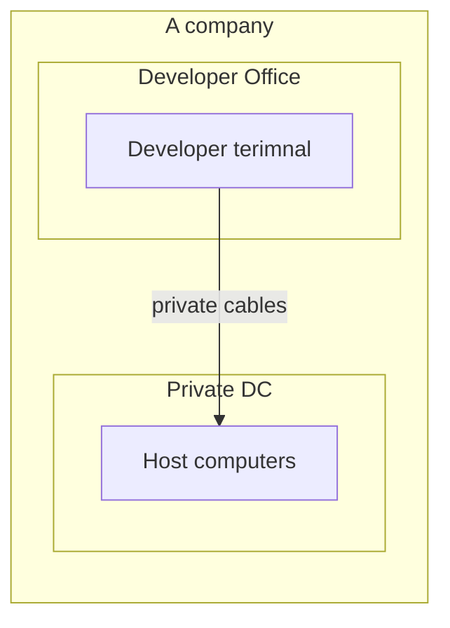
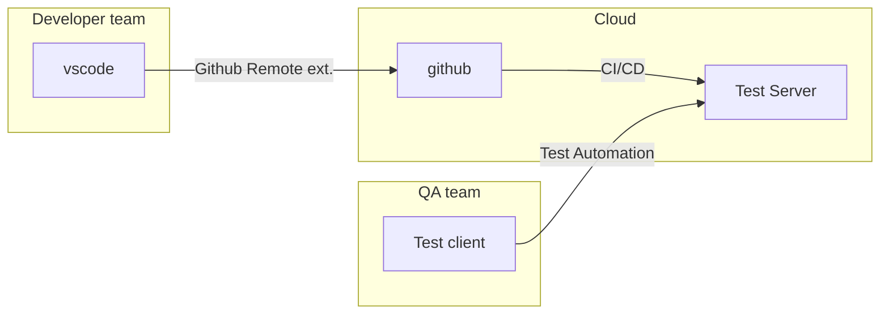
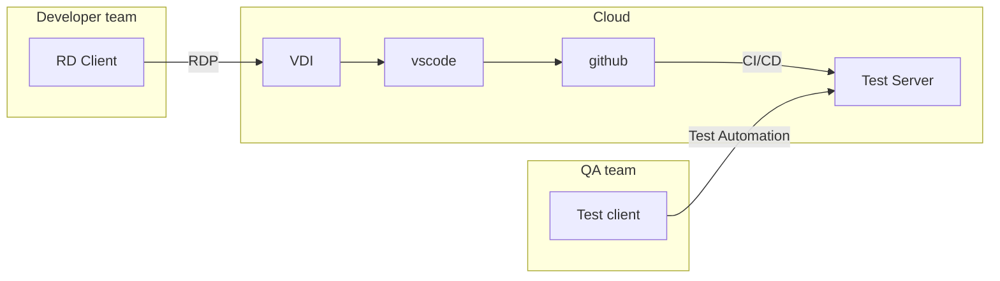
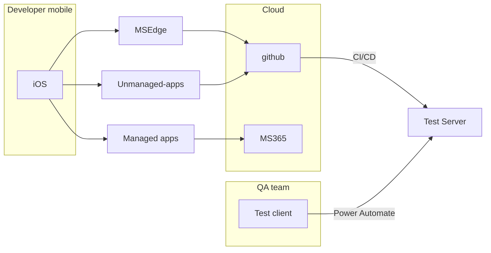
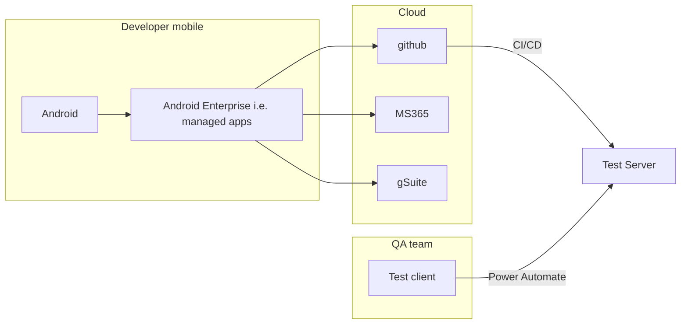

Sometimes I think I will face a doom's day that my or my client's data is exposed to ummanaged environment. i.e. the doom's day of information leakage.

There are many solutions, but as far as I have investigated, there should be some model or design to integrate them as Model, because all goals for preventing information leakage leads to following principles and each functionalities need to be evaluated for:

* Access to data should be remote, with no local cache and authorized every time an entity tries to access it.
  * in order to audit every access or to revoke access right when the entity lose access rights to data
* If data is not remote and stored locally, data should be protected securely
  * by enabling remote/local wipe for unauthorized access
  * by encrypted
* If data is local and stored unprotectedly, it should be as close as public information.
* If data is local and stored umprotectedly but still it should be highly private, it should be protected physically.

To establish these kind of security, I am considering some models.

## Secure Development Model X

I like the old days of information security, that everything is stored within a company properties,but currently this model should be applied to most valuable information, such as seed phase of crypt that the information itself has massive value.

Once upon a time, everything is stored in large local computer, which is segragated by external network and protected by brick and mortar and powerful allies.

Then gradually data is stored prvate DCs and DCs are accessed from private cupper cables.

Currently we have our information in Cloud, i.e. public DCs protected by authentication/authorization and access it from mobile devices, i.e. portable computers which is also protected by authentication/authorization.

This model is not only for large host computers, but also for everything we have as human, and historically comfirmed model from a dawn of culture, highly secure, but if we continue to apply this model to computer, it means giving up to improve productivity.

## Secure Development Model A

Model for PC/Mac/Linux or managed-browsers in iOS/Android.

* Design of Secure Development Model A
  * Fits to internal workers
  * vscode with github remote ext.
    * no local data
      * Except for uncommit changes. They are tentatively stored in local, but they will be deleted upon commit.
      * Path: *~/.config/Code/User/globalStorage/github.remotehub/72bb7349426f41243db756b4690af534/changestore/vscode-vfs-github/*
  * All setup is forced by MDM managed or sudited by checking script.

## Secure Development Model B

Model for PC/Mac or managed-browsers in iOS/Android. We are unable to use Linux as lack of good VDI client. ( I am failed to pickup client for WVD/AVD/Cloud PC/Windows 365. )

* Design of Secure Development Model B
  * Fits to external workers.
  * no local data
  * All setup is forced by MDM managed or sudited by checking script.

## Secure Development Model C

Model for iOS/Android. Basic concept is the same, managed apps which are deployed by MDM is recommended, because they supports many restrictions to prevent data access without periodically authentication check. But as for protection of edge of mobile, there are many and scatterd functions and apps, so protecting local data and local cache and periodical check of authentication of remote data access is **very tough challenge** to do. So I'd recomment this model is used to access limited range of information, which will not impact run-the-business of company.

This is for iOS.

This is for Android.

* Design of Secure Development Model C
  * Fits to mobile workers to do instant work, less important work.
  * Some data is remote, some are local.
  * Some setup is forced by MDM managed or sudited by checking script.

## Tentative conclution

There is no complete security, and security should be implemented as Swiss-Cheese model, but these fact does not mean we could let security functions as it is, as scattered as like Swiss-Cheese. I think we need to build some level of design of security, check periodically and fix periodically to direction of complete security balaced with UX.
