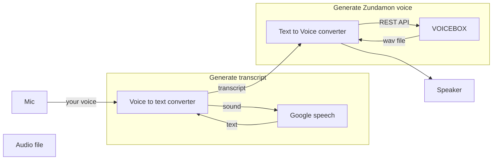

VOICEVOX make to feel better, as your voice is converted to cute Zundamon. In this article I am going to show to how to do it; the result is crancy still.

## How it works

Thanks for built-in functionality of REST API of VOICEBOX, you can easily convert your voice to Zundamon.

- This method is to convert your voice as transcript using Google Speech API and then convert the transcript to Zundamon using VOICEVOX
- Huge latency and no proper datastream is implemented, but it just works.
- Used named pipe for internal communication.



## Implementation

### VOICEVOX installation

Just download and install it.
<https://voicevox.hiroshiba.jp/>

Thanks to Hiho-san that VOICEBOX has built-in REST API so just executing binary provides the entry point of API in localhost.

### text-to-voice.sh

Retrieve wave file from VOICEVOX and play it using aplay.

```bash
while true; do
 python3 voicevox.py -id 1 -t "`cat text1.fifo`";aplay voicevox_000.wav
 rm voicevox_000.wav
 sleep 1
done
```

### voicevox.py

Quoted from <https://ponkichi.blog/voicevox-python-curl/>

```python
#quoted from https://ponkichi.blog/voicevox-python-curl/
import requests
import argparse
import json

# VOICEVOXをインストールしたPCのホスト名を指定してください
HOSTNAME='localhost'

# コマンド引数
parser = argparse.ArgumentParser(description='VOICEVOX API')
parser.add_argument('-t','--text',  type=str, required=True, help='読み上げるテ>キスト')
parser.add_argument('-id','--speaker_id' , type=int, default=2, help='話者ID')
parser.add_argument('-f','--filename', type=str, default='voicevox', help='ファ>イル名')
parser.add_argument('-o','--output_path',  type=str, default='.', help='出力パス名')

# コマンド引数分析
args = parser.parse_args()
input_texts = args.text
speaker     = args.speaker_id
filename    = args.filename
output_path = args.output_path

#「 。」で文章を区切り１行ずつ音声合成させる
texts = input_texts.split('。')

# 音声合成処理のループ
for i, text in enumerate(texts):
    # 文字列が空の場合は処理しない
    if text == '': continue

    # audio_query (音声合成用のクエリを作成するAPI)
    res1 = requests.post('http://' + HOSTNAME + ':50021/audio_query',
                        params={'text': text, 'speaker': speaker})
    # synthesis (音声合成するAPI)
    res2 = requests.post('http://' + HOSTNAME + ':50021/synthesis',
                        params={'speaker': speaker},
                        data=json.dumps(res1.json()))
    # wavファイルに書き込み
    with open(output_path + '/' + filename + f'_%03d.wav' %i, mode='wb') as f:
        f.write(res2.content)
```

### voice-to-text.py

Quoted from <https://niyanmemo.com/2255/>

```python
#!/bin/python3
#quoted from https://niyanmemo.com/2255/
import time
import speech_recognition
import pyaudio

SAMPLERATE = 44100
sprec_text_prev = ''

def callback(in_data, frame_count, time_info, status):
    global sprec 
    try:
        audiodata = speech_recognition.AudioData(in_data,SAMPLERATE,2)
        sprec_text = sprec.recognize_google(audiodata, language='ja-JP')
        print(sprec_text)
        with open("text1.fifo", 'w') as f:
            f.write(sprec_text)
            sprec_text = ''
            f.close()
        print("=====")
    except speech_recognition.UnknownValueError:
        pass
    except speech_recognition.RequestError as e:
        pass
    finally:
        return (None, pyaudio.paContinue)
    
def main():
    global sprec 
    sprec = speech_recognition.Recognizer()  # インスタンスを生成
    # Audio インスタンス取得
    audio = pyaudio.PyAudio() 
    stream = audio.open( format = pyaudio.paInt16,
                        rate = SAMPLERATE,
                        channels = 1, 
                        input_device_index = 9,
                        input = True, 
                        frames_per_buffer = SAMPLERATE*2, # 2秒周期でコールバック
                        stream_callback=callback)
    stream.start_stream()
    while stream.is_active():
        time.sleep(0.1)
    
    stream.stop_stream()
    stream.close()
    audio.terminate()
    

    
if __name__ == '__main__':
    main()
```

### named pipe

```bash
mkfifo text1.fifo
```

## Putting altogether run

```bash
text-to-voice.sh &
voice-to-text.py &
```
