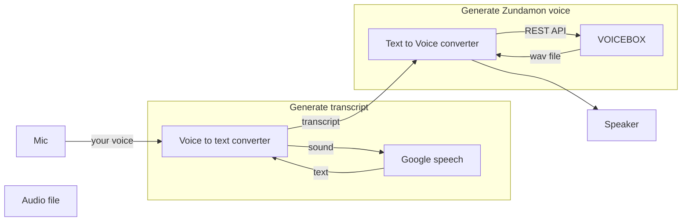

VOICEVOX make to feel better, as your voice is converted to cute Zundamon. In this article I am going to show to how to do it; the result is crancy still.

## How it works

Thanks for built-in functionality of REST API of VOICEBOX, you can easily convert your voice to Zundamon.

- This method is to convert your voice as transcript using Google Speech API and then convert the transcript to Zundamon using VOICEVOX
- Huge latency and no proper datastream is implemented, but it just works.
- Used named pipe for internal communication.



## Implementation

### VOICEVOX installation

Just download and install it.
<https://voicevox.hiroshiba.jp/>

Thanks to Hiho-san that VOICEBOX has built-in REST API so just executing binary provides the entry point of API in localhost.

### text-to-voice.sh

Retrieve wave file from VOICEVOX and play it using aplay.

```bash
while true; do
 python3 voicevox.py -id 1 -t "`cat text1.fifo`";aplay voicevox_000.wav
 rm voicevox_000.wav
 sleep 1
done
```

### voicevox.py

Quoted from <https://ponkichi.blog/voicevox-python-curl/>

```python
#quoted from https://ponkichi.blog/voicevox-python-curl/
import requests
import argparse
import json

# VOICEVOXをインストールしたPCのホスト名を指定してください
HOSTNAME='localhost'

# コマンド引数
parser = argparse.ArgumentParser(description='VOICEVOX API')
parser.add_argument('-t','--text',  type=str, required=True, help='読み上げるテ>キスト')
parser.add_argument('-id','--speaker_id' , type=int, default=2, help='話者ID')
parser.add_argument('-f','--filename', type=str, default='voicevox', help='ファ>イル名')
parser.add_argument('-o','--output_path',  type=str, default='.', help='出力パス名')

# コマンド引数分析
args = parser.parse_args()
input_texts = args.text
speaker     = args.speaker_id
filename    = args.filename
output_path = args.output_path

#「 。」で文章を区切り１行ずつ音声合成させる
texts = input_texts.split('。')

# 音声合成処理のループ
for i, text in enumerate(texts):
    # 文字列が空の場合は処理しない
    if text == '': continue

    # audio_query (音声合成用のクエリを作成するAPI)
    res1 = requests.post('http://' + HOSTNAME + ':50021/audio_query',
                        params={'text': text, 'speaker': speaker})
    # synthesis (音声合成するAPI)
    res2 = requests.post('http://' + HOSTNAME + ':50021/synthesis',
                        params={'speaker': speaker},
                        data=json.dumps(res1.json()))
    # wavファイルに書き込み
    with open(output_path + '/' + filename + f'_%03d.wav' %i, mode='wb') as f:
        f.write(res2.content)
```

### voice-to-text.py

Quoted from <https://niyanmemo.com/2255/>

```python
#!/bin/python3
#quoted from https://niyanmemo.com/2255/
import time
import speech_recognition
import pyaudio

SAMPLERATE = 44100
sprec_text_prev = ''

def callback(in_data, frame_count, time_info, status):
    global sprec 
    try:
        audiodata = speech_recognition.AudioData(in_data,SAMPLERATE,2)
        sprec_text = sprec.recognize_google(audiodata, language='ja-JP')
        print(sprec_text)
        with open("text1.fifo", 'w') as f:
            f.write(sprec_text)
            sprec_text = ''
            f.close()
        print("=====")
    except speech_recognition.UnknownValueError:
        pass
    except speech_recognition.RequestError as e:
        pass
    finally:
        return (None, pyaudio.paContinue)
    
def main():
    global sprec 
    sprec = speech_recognition.Recognizer()  # インスタンスを生成
    # Audio インスタンス取得
    audio = pyaudio.PyAudio() 
    stream = audio.open( format = pyaudio.paInt16,
                        rate = SAMPLERATE,
                        channels = 1, 
                        input_device_index = 9,
                        input = True, 
                        frames_per_buffer = SAMPLERATE*2, # 2秒周期でコールバック
                        stream_callback=callback)
    stream.start_stream()
    while stream.is_active():
        time.sleep(0.1)
    
    stream.stop_stream()
    stream.close()
    audio.terminate()
    

    
if __name__ == '__main__':
    main()
```

### named pipe

```bash
mkfifo text1.fifo
```

## Putting altogether run

```bash
text-to-voice.sh &
voice-to-text.py &
```

## 2nd implementation (Updated on 2023-02-13)

I have found good example for retrieving input from microphone as stream, so rewrite codes.
I think performance would be more efficient if I could take following:
 - Decom play.sh, write synthetized wav into sound device directly.
 - Prepare good performance machine for VOICEVOX on cloud like cloudRun or on-prem.

### Prepare play.sh for playing synthetized voice file.

```bash
while true; do
 # python3 voicevox.py -id 1 -t "`cat text1.fifo`";aplay voicevox_000.wav
 ls -t *.wav 2>/dev/null | tail -1 | xargs -I {} aplay {}
 ls -t *.wav 2>/dev/null | tail -1 | xargs -I {} rm {}
 sleep 1
done
```

### Prepare voice-transcript-synthesized.py for playing synthetized voice file.

```python
# from https://cloud.google.com/speech-to-text/docs/samples/speech-transcribe-streaming-mic
from __future__ import division

import re
import sys
import uuid
import _thread

from google.cloud import speech
from google.cloud import texttospeech

import pyaudio
from six.moves import queue

import requests
import argparse
import json

# Audio recording parameters
RATE = 16000
CHUNK = int(RATE / 10)  # 100ms

VOICEVOX_HOST='localhost'
SYNTHETIZE_BY='google' # google or vox

class MicrophoneStream(object):
    """Opens a recording stream as a generator yielding the audio chunks."""

    def __init__(self, rate, chunk):
        self._rate = rate
        self._chunk = chunk

        # Create a thread-safe buffer of audio data
        self._buff = queue.Queue()
        self.closed = True

    def __enter__(self):
        self._audio_interface = pyaudio.PyAudio()
        self._audio_stream = self._audio_interface.open(
            format=pyaudio.paInt16,
            # The API currently only supports 1-channel (mono) audio
            # https://goo.gl/z757pE
            channels=1,
            rate=self._rate,
            input=True,
            frames_per_buffer=self._chunk,
            # Run the audio stream asynchronously to fill the buffer object.
            # This is necessary so that the input device's buffer doesn't
            # overflow while the calling thread makes network requests, etc.
            stream_callback=self._fill_buffer,
        )

        self.closed = False

        return self

    def __exit__(self, type, value, traceback):
        self._audio_stream.stop_stream()
        self._audio_stream.close()
        self.closed = True
        # Signal the generator to terminate so that the client's
        # streaming_recognize method will not block the process termination.
        self._buff.put(None)
        self._audio_interface.terminate()

    def _fill_buffer(self, in_data, frame_count, time_info, status_flags):
        """Continuously collect data from the audio stream, into the buffer."""
        self._buff.put(in_data)
        return None, pyaudio.paContinue

    def generator(self):
        while not self.closed:
            # Use a blocking get() to ensure there's at least one chunk of
            # data, and stop iteration if the chunk is None, indicating the
            # end of the audio stream.
            chunk = self._buff.get()
            if chunk is None:
                return
            data = [chunk]

            # Now consume whatever other data's still buffered.
            while True:
                try:
                    chunk = self._buff.get(block=False)
                    if chunk is None:
                        return
                    data.append(chunk)
                except queue.Empty:
                    break

            yield b"".join(data)


def listen_print_loop(responses):
    """Iterates through server responses and prints them.

    The responses passed is a generator that will block until a response
    is provided by the server.

    Each response may contain multiple results, and each result may contain
    multiple alternatives; for details, see https://goo.gl/tjCPAU.  Here we
    print only the transcription for the top alternative of the top result.

    In this case, responses are provided for interim results as well. If the
    response is an interim one, print a line feed at the end of it, to allow
    the next result to overwrite it, until the response is a final one. For the
    final one, print a newline to preserve the finalized transcription.
    """
    num_chars_printed = 0
    for response in responses:
        if not response.results:
            continue

        # The `results` list is consecutive. For streaming, we only care about
        # the first result being considered, since once it's `is_final`, it
        # moves on to considering the next utterance.
        result = response.results[0]
        if not result.alternatives:
            continue

        # Display the transcription of the top alternative.
        transcript = result.alternatives[0].transcript

        # Display interim results, but with a carriage return at the end of the
        # line, so subsequent lines will overwrite them.
        #
        # If the previous result was longer than this one, we need to print
        # some extra spaces to overwrite the previous result
        overwrite_chars = " " * (num_chars_printed - len(transcript))

        if not result.is_final:
            sys.stdout.write(transcript + overwrite_chars + "\r")
            sys.stdout.flush()

            num_chars_printed = len(transcript)

        else:
            print(transcript + overwrite_chars + " [CONFIRMED]")
            try:
              if SYNTHETIZE_BY=='google':
                _thread.start_new_thread( synthetize_text, (transcript,) )
              elif SYNTHETIZE_BY=='vox':
                _thread.start_new_thread( synthetizeZ_text, (transcript,) )
            except:
              print("Error: unable to start thread")

            # Exit recognition if any of the transcribed phrases could be
            # one of our keywords.
            if re.search(r"\b(exit|quit)\b", transcript, re.I):
                print("Exiting..")
                break

            num_chars_printed = 0

def synthetize_text(t):
    client = texttospeech.TextToSpeechClient()

    # Set the text input to be synthesized
    synthesis_input = texttospeech.SynthesisInput(text=t)

    # Build the voice request, select the language code ("en-US") and the ssml
    # voice gender ("neutral")
    voice = texttospeech.VoiceSelectionParams(
        language_code="ja-JP", ssml_gender=texttospeech.SsmlVoiceGender.NEUTRAL
    )

    # Select the type of audio file you want returned
    audio_config = texttospeech.AudioConfig(
        audio_encoding=texttospeech.AudioEncoding.LINEAR16
    )

    # Perform the text-to-speech request on the text input with the selected
    # voice parameters and audio file type
    response = client.synthesize_speech(
        input=synthesis_input, voice=voice, audio_config=audio_config
    )

    # The response's audio_content is binary. save it as mp3 with uuid filename
    f = str(uuid.uuid4())+".wav"
    with open(f, "wb") as out:
        # Write the response to the output file.
        out.write(response.audio_content)
        print('Audio content written to file {}'.format(f))
        f=""

def synthetizeZ_text(t):
    #quoted from https://ponkichi.blog/voicevox-python-curl/
    speaker     = 3
    texts = t.split('。')
    # 音声合成処理のループ
    for i, text in enumerate(texts):
        # 文字列が空の場合は処理しない
        if text == '': continue

        # audio_query (音声合成用のクエリを作成するAPI)
        res1 = requests.post('http://' + VOICEVOX_HOST + ':50021/audio_query',
                            params={'text': text, 'speaker': speaker})
        # synthesis (音声合成するAPI)
        res2 = requests.post('http://' + VOICEVOX_HOST + ':50021/synthesis',
                            params={'speaker': speaker},
                            data=json.dumps(res1.json()))

        f = str(uuid.uuid4())+".wav"
        with open(f, "wb") as out:
            # Write the response to the output file.
            out.write(res2.content)
            print('Audio content written to file {}'.format(f))
            f=""

def main():
    # See http://g.co/cloud/speech/docs/languages
    # for a list of supported languages.
    #language_code = "en-US"  # a BCP-47 language tag
    language_code = "ja-JP"

    client = speech.SpeechClient()
    config = speech.RecognitionConfig(
        encoding=speech.RecognitionConfig.AudioEncoding.LINEAR16,
        sample_rate_hertz=RATE,
        language_code=language_code,
    )

    streaming_config = speech.StreamingRecognitionConfig(
        config=config, interim_results=True
    )

    with MicrophoneStream(RATE, CHUNK) as stream:
        audio_generator = stream.generator()
        requests = (
            speech.StreamingRecognizeRequest(audio_content=content)
            for content in audio_generator
        )

        responses = client.streaming_recognize(streaming_config, requests)

        # Now, put the transcription responses to use.
        listen_print_loop(responses)


if __name__ == "__main__":
    main()
```

### Putting altogether

```bash
./play.sh &
python3 voice-transcript-synthesized.py
```


