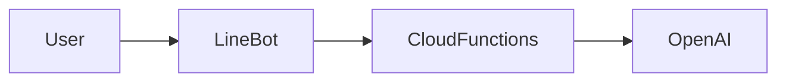

A LINE bot for generating pixel art, coded by python and running in CloudFunctions.

## How it works

This time, I have used google cloud functions as Webhook endpoint that receives request from Users through LINE channel, and used openAI's DALL-E for generating pixel art pics.




## Implementation

## Prepare Image Generator

### Grab OpenAI's API KEY

This is best. Just follow guide and be getting started.
Alongside your 1st try, you will get the API KEY accordingly.
<https://platform.openai.com/docs/quickstart>

### Prepare webhook endpoint in CloudFunctions

Sorry I am not good teacher that can write guide step by step, but I believe the best one to explain how to be get started in Cloud function is Mr/Ms Google right?
<https://cloud.google.com/functions/docs/create-deploy-http-python>

Alongside your 1st try, you will get the appropriate env, but I just would like to add some tips.

- The endpoint of cloud function needs to be anonymous to be called from LINEBot, and you also need to add permission of AllUsers to CloudRun behind cloudFunctions you have created.
- If you are planning to use AudioMessage in LINE, it's better to choose pyhon3.9 as LINE utilizes AAC(m4a) format as Audio so pydub and ffmpeg are required but ffmpeg do not run in python3.11 and python 3.10 env.
- You need to add proper permissions to the account that runs CloudFunctions, it will be different account for your local account, so basically you do not need GOOGLEAPIKEY variables when code is run in CloudFunctions.

### Deploy code to CloudFunctions

#### Environment VARIABLES

```bash
LINE_CHANNEL_ACCESS_TOKEN=YOUR_KEY_INFO1
LINE_CHANNEL_SECRET=YOUR_KEY_INFO2
OPENAI_API_KEY=YOUR_KEY_INFO3
```

#### main.py

```python
import functions_framework
import requests
import json
import os
import html
import re
from dotenv import load_dotenv, find_dotenv
from linebot import LineBotApi, WebhookHandler
from linebot.exceptions import InvalidSignatureError
from linebot.models import MessageEvent, TextMessage, TextSendMessage, ImageSendMessage, VideoSendMessage, TemplateSendMessage, CarouselTemplate, CarouselColumn

load_dotenv(find_dotenv())
line_bot_api = LineBotApi(os.getenv("LINE_CHANNEL_ACCESS_TOKEN"))
handler      = WebhookHandler(os.getenv("LINE_CHANNEL_SECRET"))

IMAGE_QUERY_URL    = "https://api.openai.com/v1/images/generations"
openai_key   = os.getenv("OPENAI_API_KEY")

@functions_framework.http
def hello_http(request):
   #return generate_dalle_image_from_request(request) # for invoking from curl
   return lineEventHandler(request)                   # for invoking from LINE

def lineEventHandler(request):
  signature = request.headers['X-Line-Signature']

  body = request.get_data(as_text=True)
  print("Request body: " + body)
  try:
      handler.handle(body, signature)
  except InvalidSignatureError:
      return "", 400

  return 'OK'

@handler.add(MessageEvent, message=TextMessage)
def handle_message(event):
    text_message  = TextSendMessage(text="🖍️描いています...")
    url = generate_dalle_image_from_str(event.message.text)
    image_message = ImageSendMessage(original_content_url=url, preview_image_url=url)

    messages = [text_message, image_message]
    line_bot_api.reply_message(
        event.reply_token,
        messages)

def sanitize(string):
    # Remove HTML tags
    string = html.escape(string)
    # Remove potentially harmful characters
    string = re.sub(r'[^\w\s]+', '', string)
    # Remove JavaScript code
    string = re.sub(r'<script.*?>.*?</script>', '', string, flags=re.DOTALL | re.IGNORECASE)
    # Remove SQL commands
    string = re.sub(r'(\b(ALTER|CREATE|DELETE|DROP|EXEC(UTE){0,1}|INSERT( +INTO){0,1}|MERGE|SELECT|UPDATE|UNION( +ALL){0,1})\b)', '', string, flags=re.IGNORECASE)
    # Remove other possible harmful characters
    return string.replace("@", "at")\
                 .replace(".", "dot")\
                 .replace("/", "slash")\
                 .replace("?", "question")\
                 .replace("=", "equals")\
                 .replace("&", "and")\
                 .replace("%", "percent")\
                 .replace("$", "dollar")\
                 .replace("#", "hash")\
                 .replace("!", "exclamation")\
                 .replace(">", "greater")\
                 .replace("<", "lesser")\
                 .replace(":", "colon")\
                 .replace(";", "semicolon")\
                 .replace("{", "braceleft")\
                 .replace("}", "braceright")\
                 .replace("[", "bracketleft")\
                 .replace("]", "bracketright")\
                 .replace("(", "parenleft")\
                 .replace(")", "parenright")\
                 .replace("'", "apostrophe")\
                 .replace('"', "quotemark")\
                 .replace(",", "comma")\
                 .replace("~", "tilde")\
                 .replace("`", "backtick")\
                 .replace("^", "caret")\
                 .replace("|", "verticalbar")\
                 .replace("\\", "backslash")\
                 .replace(" ", "-")\
                 .replace("*", "asterisk")

def generate_prompt(seed):
    seed = sanitize(seed)
    return """{} as cute pixel art, like octopath traveller. Full color. High resolutions. Nintendo Switch. Kawaii. The background is something fantastic with wander.""".format(
        seed.capitalize()
    )

def get_dalle_image(prompt):
    prompt = sanitize(prompt)

    # Request header
    headers = {
        "Content-Type": "application/json",
        "Authorization": "Bearer {}".format(openai_key)
    }

    # Request data
    data = {
        "model": "image-alpha-001",
        "prompt": prompt,
        "num_images":1,
        "size":"512x512",
        "response_format":"url"
    }

    # Make a request to DALL-E API
    resp = requests.post(IMAGE_QUERY_URL, headers=headers, data=json.dumps(data))

    # Check if request is successful
    if resp.status_code != 200:
        return "Failed to generate image. Error: {}".format(resp.content)

    # Return the URL of the generated image
    response_json = resp.json()
    return response_json['data'][0]['url']

def generate_dalle_image_from_str(s):
    return get_dalle_image(generate_prompt(s))

def generate_dalle_image_from_request(request):
    if request.method != "POST":
        return "Only POST requests are accepted", 405
    elif not request.headers.get("Content-Type") == "application/json":
        return "Only application/json requests are accepted", 415
    
    request_json = request.get_json()
    s = request_json.get("prompt")
    return get_dalle_image(generate_prompt(s))
```

#### requirements.txt

```python
functions-framework==3.*
python-dotenv==0.19.2
future==0.18.3
line-bot-sdk==2.4.1
requests==2.28.1
openai==0.26.0
```

### Make LineBot as channel and set CloudFunction as Webhook endpoint

I am very happy to live in this internet era. You can get everyting you need just build small app guided by this:
<https://developers.line.biz/en/docs/messaging-api/building-bot/>

## Tips on Cloud Functions

You are unable to use pydub ( ffmpeg ) at Python3.11 and 3.10.
Use 3.9 otherwise you will face errors.

### rerefence

Cloud function do supports pydub ( ffmpeg ), but Python311 and 310 env are unable to include them as base image itself do not include ffmpeg.
<https://issuetracker.google.com/issues/242685280?pli=1>

### errors

```bash
File "/layers/google.python.runtime/python/lib/python3.10/subprocess.py", line 1847, in _execute_child raise child_exception_type(errno_num, err_msg, err_filename) FileNotFoundError: [Errno 2] No such file or directory: 'ffprobe'
```

### Appendix

You can build ChatGPT like chatBot using this framework.
I will drop sample code that demonstrates text and voice based communication with GPT in openai's cloud. Please feel free to contact me if you are curious to implement yours.

<https://twitter.com/rtree>

#### main.py

#### Environment VARIABLES

```bash
LINE_CHANNEL_ACCESS_TOKEN=YOUR_KEY_INFO1
LINE_CHANNEL_SECRET=YOUR_KEY_INFO2
OPENAI_API_KEY=YOUR_KEY_INFO3
BUCKET_NAME=YOUR_BUCKET_NAME
```

```python
import openai
import io
import os
import datetime
from dotenv import load_dotenv, find_dotenv
import uuid
import wave
from pydub import AudioSegment
import html
import re
import random
from google.cloud import texttospeech
from google.cloud import storage
from google.cloud import speech_v1 as speech

# for remote implementation
import functions_framework
import requests
import json
from linebot import LineBotApi, WebhookHandler
from linebot.exceptions import InvalidSignatureError
from linebot.models import MessageEvent, TextMessage, TextSendMessage, ImageSendMessage, VideoSendMessage, TemplateSendMessage, CarouselTemplate, CarouselColumn, AudioSendMessage, AudioMessage

load_dotenv(find_dotenv())
BUCKET_NAME  = os.environ.get("BUCKET_NAME")
line_bot_api = LineBotApi(os.getenv("LINE_CHANNEL_ACCESS_TOKEN"))
handler      = WebhookHandler(os.getenv("LINE_CHANNEL_SECRET"))
openai.api_key = os.environ.get("OPENAI_API_KEY")

#def BUCKET_NAME:
#    load_dotenv(find_dotenv())
#    return os.environ.get("BUCKET_NAME")

@functions_framework.http
def hello_http(request):
   #return generate_dalle_image_from_request(request) # for invoking from curl
   return lineEventHandler(request)                   # for invoking from LINE

def lineEventHandler(request):
  signature = request.headers['X-Line-Signature']
  body = request.get_data(as_text=True)
  print("Request body: " + body)
  try:
      handler.handle(body, signature)
  except InvalidSignatureError:
      return "", 400

  return 'OK'

@handler.add(MessageEvent, message=TextMessage)
def handle_text_message(event):
    if isinstance(event.message, TextMessage):
        text_message  = TextSendMessage(text="🤖考えています...")

        ## reply with the same text as the user sent in voice                
        #url = synthetize_text_and_upload_public(event.message.text)
        #duration = str(int(float(url.split("_")[2])*1000))    # in milliseconds
        #audio_message = AudioSendMessage(original_content_url=url, duration=duration)

        reply = get_answer_from_openai_test(event.message.text)
        #text_message_reply = TextSendMessage(text=
        #                                     f"私「{event.message.text}」\nあなた「{reply}」")
        text_message_reply = TextSendMessage(text=reply)

        messages = [text_message, text_message_reply]
        line_bot_api.reply_message(
            event.reply_token,
            messages)

@handler.add(MessageEvent, message=AudioMessage)
def handle__audio_message(event):
    if isinstance(event.message, AudioMessage):
        text_message  = TextSendMessage(text="🤖考えています...")

        audio_message = event.message
        audio_content = convert_m4a_to_wave(line_bot_api.get_message_content(audio_message.id).content)
        #print("Audio content: " + str(audio_content))
        #print("Audio duration: " + str(audio_message.duration))
        #upload_wav_to_bucket(audio_content, "private")
        transcript = transcribe_bytes(audio_content)

        url = synthetize_text_and_upload_public(answer_filter(get_answer_from_openai_test(transcript)))
        duration = str(int(float(url.split("_")[2])*1000)) 
        audio_message = AudioSendMessage(original_content_url=url, duration=duration)

        messages = [text_message, audio_message]
        line_bot_api.reply_message(
            event.reply_token,
            messages)

def sanitize(string):
    # Remove HTML tags
    string = html.escape(string)
    # Remove potentially harmful characters
    string = re.sub(r'[^\w\s]+', '', string)
    # Remove JavaScript code
    string = re.sub(r'<script.*?>.*?</script>', '', string, flags=re.DOTALL | re.IGNORECASE)
    # Remove SQL commands
    string = re.sub(r'(\b(ALTER|CREATE|DELETE|DROP|EXEC(UTE){0,1}|INSERT( +INTO){0,1}|MERGE|SELECT|UPDATE|UNION( +ALL){0,1})\b)', '', string, flags=re.IGNORECASE)
    # Remove other possible harmful characters
    return string.replace("@", "at")\
                 .replace(".", "dot")\
                 .replace("/", "slash")\
                 .replace("?", "question")\
                 .replace("=", "equals")\
                 .replace("&", "and")\
                 .replace("%", "percent")\
                 .replace("$", "dollar")\
                 .replace("#", "hash")\
                 .replace("!", "exclamation")\
                 .replace(">", "greater")\
                 .replace("<", "lesser")\
                 .replace(":", "colon")\
                 .replace(";", "semicolon")\
                 .replace("{", "braceleft")\
                 .replace("}", "braceright")\
                 .replace("[", "bracketleft")\
                 .replace("]", "bracketright")\
                 .replace("(", "parenleft")\
                 .replace(")", "parenright")\
                 .replace("'", "apostrophe")\
                 .replace('"', "quotemark")\
                 .replace(",", "comma")\
                 .replace("~", "tilde")\
                 .replace("`", "backtick")\
                 .replace("^", "caret")\
                 .replace("|", "verticalbar")\
                 .replace("\\", "backslash")\
                 .replace(" ", "-")\
                 .replace("*", "asterisk")


def answer_filter(answer):
    #replace \n and ? with empty string
    answer = answer.replace("　", "").replace("\n", "").replace(" ", "")
    #split answer by "。" and return the first 2 sentences
    #but if there is only one sentence, return the whole answer
    #fragments = answer.split("。")
    #if len(fragments) == 1:
    #    return answer
    #elif len(fragments) >= 2:
    #    return "。".join(fragments[:2])
    #elif len(fragments) >= 3:
    #    return "。".join(fragments[:3])
    return answer

def get_answer_from_openai_test(question):
    prompt = question
    
    response = openai.Completion.create(
        engine="text-davinci-003", 
        prompt=prompt, 
        temperature=0.5,
        max_tokens=250, 
        top_p=1, 
        n=1,
        frequency_penalty=0, 
        presence_penalty=0
    )
    if response.choices:
        answer = response.choices[0].text.strip()
    else:
        answer = "答えが見つかりませんでした"
    return answer

def convert_m4a_to_wave(m4a_data):
    audio = AudioSegment.from_file(io.BytesIO(m4a_data), format='m4a')
    wave_data = audio.export(format='wav').read()
    return wave_data

def get_duration_m4a(audio_content):
    audio_stream = io.BytesIO(audio_content)
    audio = AudioSegment.from_file(audio_stream, format='m4a')
    duration_ms = len(audio)
    duration = duration_ms / 1000
    return duration

def get_duration(audio_content):
    with io.BytesIO(audio_content) as f:
        with wave.open(f, "rb") as wave_file:
            frames = wave_file.getnframes()
            rate = wave_file.getframerate()
            duration = frames / float(rate)
    return duration

def transcribe_bytes(audio_content):
    audio_stream = io.BytesIO(audio_content)

    # Initialize the Google Cloud Speech-to-Text client
    client = speech.SpeechClient()

    # Set the audio configuration
    config = speech.RecognitionConfig(
        encoding=speech.RecognitionConfig.AudioEncoding.LINEAR16,
        language_code="ja-JP"
    )

    # Transcribe the audio
    audio    = speech.RecognitionAudio(content=audio_stream.getvalue())
    response = client.recognize(config=config, audio=audio)

    return response.results[0].alternatives[0].transcript

def synthetize_text(t):
    client = texttospeech.TextToSpeechClient()

    # Set the text input to be synthesized
    synthesis_input = texttospeech.SynthesisInput(text=t)

    # Build the voice request, select the language code ("en-US") and the ssml
    # voice gender ("neutral")
    voice = texttospeech.VoiceSelectionParams(
        language_code="ja-JP", ssml_gender=texttospeech.SsmlVoiceGender.NEUTRAL
    )

    # Select the type of audio file you want returned
    audio_config = texttospeech.AudioConfig(
        audio_encoding=texttospeech.AudioEncoding.LINEAR16
    )

    # Perform the text-to-speech request on the text input with the selected
    # voice parameters and audio file type
    response = client.synthesize_speech(
        input=synthesis_input, voice=voice, audio_config=audio_config
    )

    # Return the audio content
    return response.audio_content

def upload_wav_to_bucket(audio_content, sharedType):
    # Calculate the duration of the audio
    duration = get_duration(audio_content)

    # Construct the file name
    uuidstr = str(uuid.uuid4())
    if sharedType == "public":
        file_name = f"public_{uuidstr}_{duration}_.wav"
    elif sharedType == "temporary":
        file_name = f"tempor_{uuidstr}_{duration}_.wav"
    else:
        file_name = f"privat_{uuidstr}_{duration}_.wav"

    # Upload the audio content to the Google Cloud Storage bucket
    storage_client = storage.Client()
    bucket = storage_client.bucket("{}".format(BUCKET_NAME))
    blob = bucket.blob(file_name)
    blob.upload_from_string(audio_content, content_type="audio/wav")

    if sharedType == "public":
        # Make the uploaded file public
        blob.make_public()
        return blob.public_url
    elif sharedType == "temporary":
        return  blob.generate_signed_url(datetime.timedelta(minutes=30))
    else:
        return f"https://storage.googleapis.com/{BUCKET_NAME}/{file_name}"

def synthetize_text_and_upload_public(t):
    # Synthetize the text
    t = sanitize(t)
    audio_content = synthetize_text(t)
    return upload_wav_to_bucket(audio_content, "public")

def synthetize_text_and_upload_temp(t):
    # Synthetize the text
    t = sanitize(t)
    audio_content = synthetize_text(t)
    return upload_wav_to_bucket(audio_content, "temporary")

def synthetize_text_and_upload(t):
    # Synthetize the text
    t = sanitize(t)
    audio_content = synthetize_text(t)
    return upload_wav_to_bucket(audio_content, "private")
```

#### requirements.txt

```python
aiohttp==3.8.3
aiosignal==1.3.1
async-timeout==4.0.2
attrs==22.2.0
beautifulsoup4==4.11.2
cachetools==5.3.0
certifi==2022.12.7
cffi==1.15.1
charset-normalizer==2.1.1
click==8.1.3
cloudevents==1.9.0
deprecation==2.1.0
Flask==2.2.2
frozenlist==1.3.3
functions-framework==3.3.0
future==0.18.3
google==3.0.0
google-api-core==2.11.0
google-api-python-client==2.78.0
google-auth==2.16.0
google-auth-httplib2==0.1.0
google-cloud==0.34.0
google-cloud-core==2.3.2
google-cloud-speech==2.17.3
google-cloud-storage==2.7.0
google-cloud-texttospeech==2.14.1
google-crc32c==1.5.0
google-resumable-media==2.4.1
googleapis-common-protos==1.58.0
grpcio==1.51.1
grpcio-status==1.51.1
gunicorn==20.1.0
httplib2==0.21.0
idna==3.4
itsdangerous==2.1.2
Jinja2==3.1.2
line-bot-sdk==2.4.1
MarkupSafe==2.1.2
multidict==6.0.4
openai==0.26.5
packaging==23.0
proto-plus==1.22.2
protobuf==4.21.12
pyasn1==0.4.8
pyasn1-modules==0.2.8
pycparser==2.21
pydub==0.25.1
pyparsing==3.0.9
python-dotenv==0.21.1
requests==2.28.1
rsa==4.9
six==1.16.0
soundfile==0.12.1
soupsieve==2.4
tqdm==4.64.1
uritemplate==4.1.1
urllib3==1.26.14
watchdog==2.2.1
Werkzeug==2.2.3
yarl==1.8.2
```

